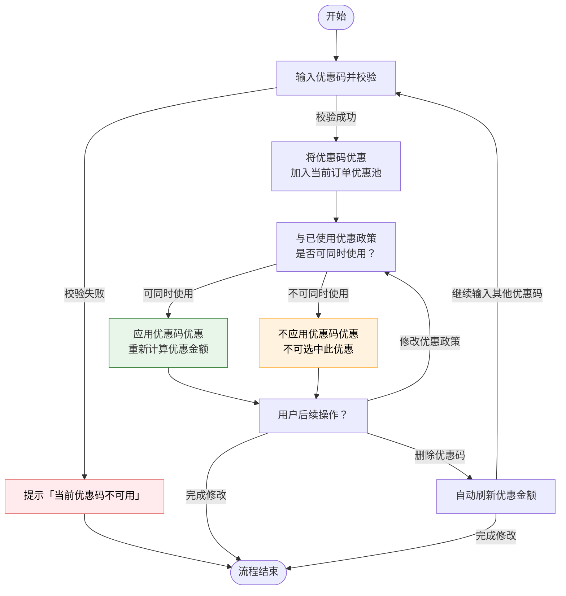
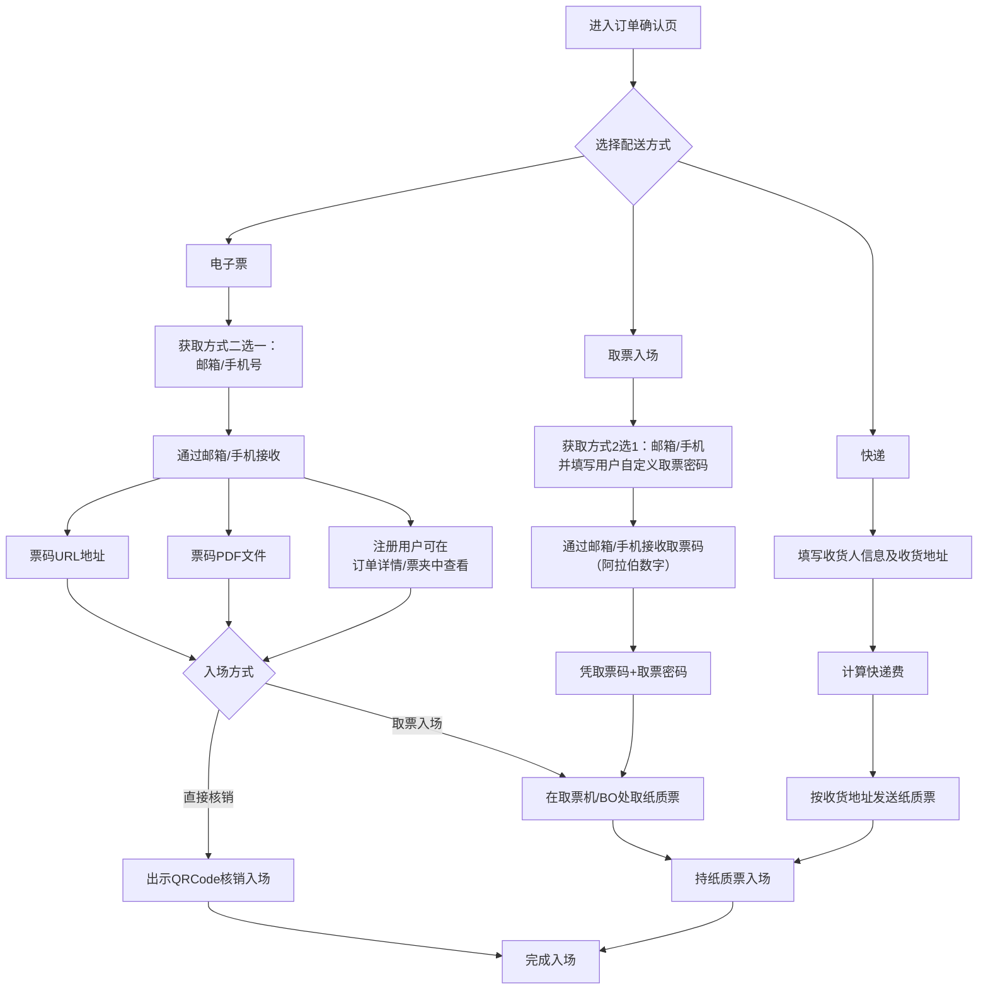
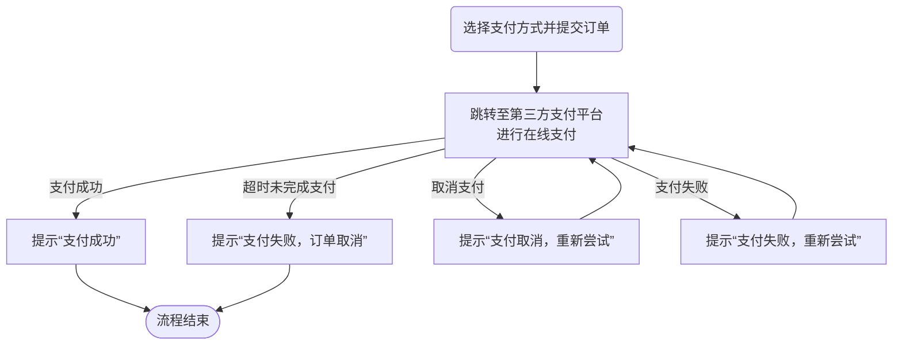
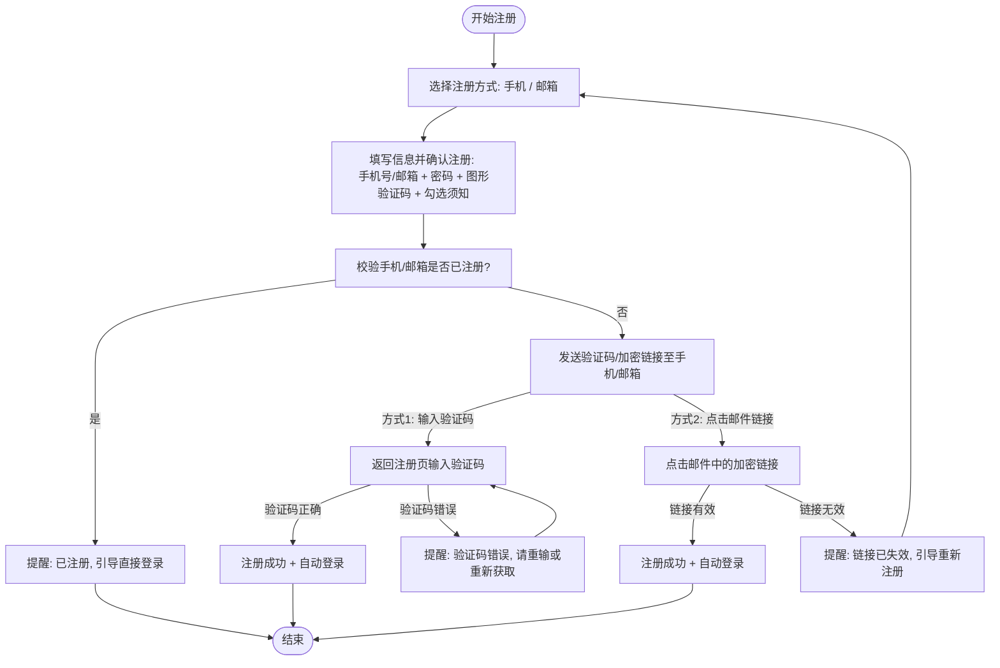
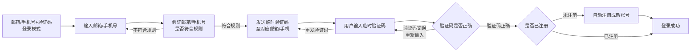
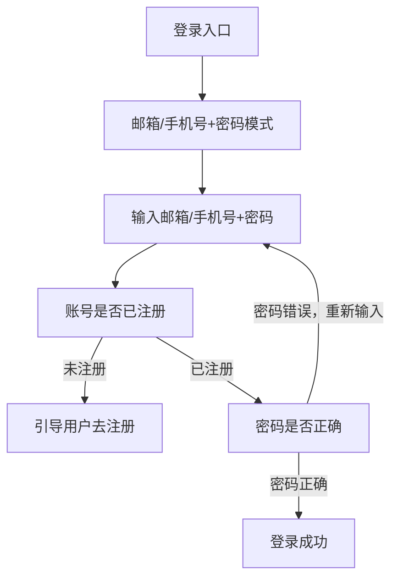
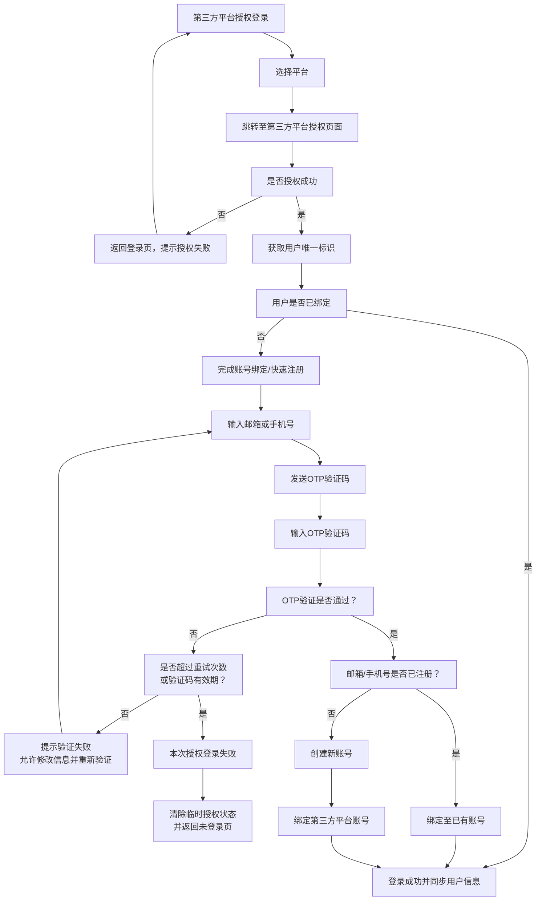
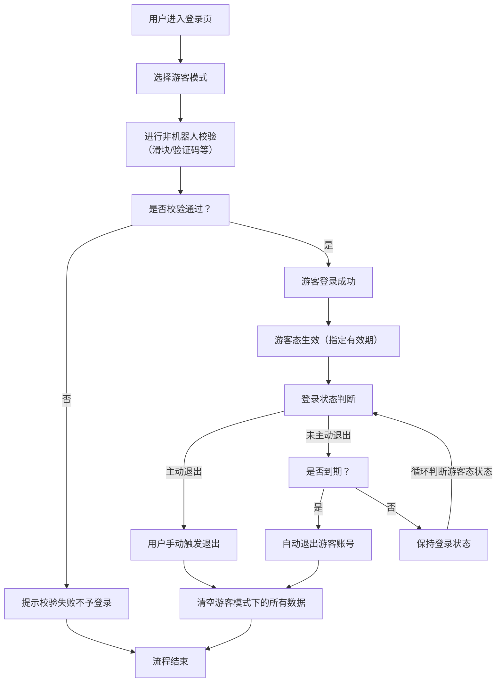

# 国际版标准官网 \- 在线购票

*（相邻版本之间的所有改动均需记录在上表中，版本号格式为1\.0、1\.1、1\.2……。生成新的版本后，在第一部分的“创建日期”里记下新版本的生成日期。）*

# 概述

## 需求说明

为了满足海外用户的购票习惯，需要基于现有的标准H5购票流程进行调整，调整后需要满足以下场景：

1. 需要支持游客模式，即无需注册会员也可以完成购票（临时账号模式）

2. 选座需要支持系统自动选座和用户自主选座，且针对热门项目仅支持系统自动选座用户不得修改所选座位

3. 在线选座需要支持轮椅座、陪伴座、桌子、混合座位等模式

4. 针对特殊票种，可以支持非强制校验（无需填写实名，或只需要填写姓名\+证件类型即可）

5. 在选座购票过程中，用户选中座位后，可以选择按不同的价格进行结算（通过特殊票种实现）

6. 选座购票过程中，仍在生成订单时进行锁座，但是在购票步骤中需要明确告知用户是在哪个步骤锁座的

7. 取票模式为电子票时，可以选择：邮件、短信、取票码

8. 需要支持购物车模式，即多个项目场次（门票\+选座）可以一起提交一起完成在线支付

9. 支持多语言切换

10. 支持PC和移动端浏览模式的自适应

> 需求分析文档：[《标准H5/PC购票需求说明（讨论稿）》](https://www.yuque.com/gebiao/kmdpen/gi3sir6l7ueiho6p)
> 
> 

## 目标人群

## 名词解释

## 参考文档

1. [Website Accessibility](https://wtvrhpmlkj.feishu.cn/wiki/Om1CwVuTyiMGq1kM6UrcbChWnYd?from=from_copylink)（网站无障碍功能说明）——西九需求

2. 无障碍检查小工具：https://webaim\.org/resources/contrastchecker/

3. [语雀文档：《标准小程序3\.0》章节2\.10](https://www.yuque.com/gebiao/kmdpen/ycp3icyro4ksppmt#pgvtR)


# 在线购票功能设计

## 在线购票整体流程

## 项目详情功能说明

显示内容：项目名称、有效期、场馆场地、类别、海报、内容介绍、购票须知等

todo：按小程序3\.0版本功能，转化为网页UI，包括：购票须知、优惠显示、想看、抢票攻略。

## 场次及票价

进入项目详情后，不展示当前项目的场次或票价信息，**点击“购票”按钮后，加载场次及票价信息**；

点击购票时，需要强制用户登录，并在用户登录成功后，按当前登录用户的相关权限显示对应信息。例如，倒计时信息、优先购、会员专享等。

### 场次展示及对应功能

场次的展示方式包含2种（现有功能）

1. 日历模式——以日历方式显示当前项目可购日期信息，用户需要先选择日期，才会显示该日期下的场次/时段信息；

2. 行模式——以行方式显示当前项目可购场次/时段信息

日期状态（小程序3\.0版本功能）：TODO:缺少日期状态UI

|状态|说明|交互|
|---|---|---|
|不可售|当前日期下可售场次数=0，或者已过期日期|不可点击选择|
|售罄|当前日期下所有场次状态均为“售罄”|不可点击选择|
|可售|当前日期下包含可售场次≥1|点击后，显示当前日期下所有场次信息，同时收起日历仅显示已选日期所在一周日期|

场次/时段显示方式：

1. 显示场次时间显示场次开始时间。例如：2026\-6\-1 10:00

2. 显示场次名称。例如：2026年2月1日 上午

场次/时段状态：

|状态|说明|交互|
|---|---|---|
|已过期|场次/时段的结束时间＜当前时间|不可点击选择|
|售罄|- 场次“可入场人数”不限时：所有票种的可售数均为0<br>- 场次“可入场人数”有上限时：可入场人数余0，或所有票种的可售数均为0|不可点击选择|
|未开售|未在可售时间内，且场次/时段的结束时间≥当前时间|不可点击选择|
|可售|激活且在可售时间内，且有库存。<br>- 充足：剩余可售数≥设定的临界值；<br>- 紧张：剩余可售数＜设定的临界值且＞0<br>|点击后，显示当前场次下所有票价票种信息<br>做成企业级配置参数：库存显示方式<br>|


### 票价展示及对应功能

选中场次后，即显示当前场次的相关票价/票种信息（小程序3\.0版本功能）。

||选座|门票/无座|
|---|---|---|
|显示内容|1. 基础票价：<br>    1. 票价<br>    2. 票价区域<br>    3. 状态：可售/售罄<br>    <br>2. 套票：<br>    1. 套票名称<br>    2. 套票说明<br>    3. 套票状态：可售/售罄|1. 基础票种：<br>    1. 票种名称<br>    2. 票价<br>    3. 票种说明<br>    4. 状态：充足/紧张/售罄<br>2. 套票：<br>    1. 套票名称<br>    2. 套票说明<br>    3. 套票包含基础票种信息<br>    4. 套票状态：可售/售罄|
|交互说明|选中后可进行自动选座或手动选座|可直接选择购买数量并进入下一步|
|界面示例|<br>||


### 倒计时（非V1\.0强需求）

现有小程序3\.0功能，逻辑功能不变，按PC/H5调整页面。TODO:缺少在项目详情页和场次选择页的倒计时显示UI

|显示逻辑|- **项目详情页：**计算当前项目所有已激活且未开票场次的当前渠道的场次开票时间，把距离当前时间最近的作为项目的开票时间<br>- **场次列表：**选中场次后，显示当前场次当前渠道的开票时间（如果项目是日历模式，在选择日期时，倒计时信息不变）|
|---|---|
|无优先购|无论是否登录，按场次上当前渠道的开票时间进行计算并显示|
|优先购|- **未登录：**按场次上当前渠道的开票时间进行计算<br>- **已登录：**按当前登录会员的实际开票时间进行计算|
|本地时间|开售时间为演出地时间，一般为服务器时间（海外版是否要考虑时区问题？例如服务器时间和演出所在地时间不一致的问题）——待讨论<br>倒计时显示为相对时间，开售时间和当前时间都使用同一个服务器时间进行计算。|


### 预约抢票（非V1\.0强需求）

现有小程序3\.0功能，逻辑功能不变，按PC/H5调整页面。已有

这里需要考虑时差问题，按服务器时间？

### 缺货登记（非V1\.0强需求）

现有小程序3\.0功能，逻辑功能不变，按PC/H5调整页面。

TODO:缺少缺货登记UI

### 开售提醒

直接调用手机日历功能是否可行（能否检测到当前设备是否手机？）——待确认。不可以，不支持。

增加邮件提醒功能。——待设计

## 选座功能

交互线框图参考（请选择项目《经典原版音乐剧《剧院魅影续作：真爱永恒》》）：https://ai\.studio/apps/c7f9dc5a\-a8a4\-4e0b\-b0d7\-c523d3060b9b?fullscreenApplet=true

### 选座流程概览

选座分为2种模式：

1. **自助选座**。直接进入选座页面，由用户自己手动选择座位。

2. **系统帮选**。（V1\.1 功能）由用户选择票价数量等选座规则，由系统按最优方式进行选座。该模式下可支持2种模式：

    1. 支持用户自助选座。即在系统选定之后，可以进入选座页手动修改所选座位

    2. 不支持用户自助选座。即在系统选定后，用户不能进入选座页手动修改所选座位，但是支持让系统重新选座或者修改选座规则后让系统重选；

    3. **第一版不考虑2种都支持的情况**

以上模式可以在场次管理中进行配置。

\*说明：此图示意的双模式第一版暂不支持。

### 用户自主选座

#### 选座功能说明

选座面板主要由3部分组成：

1. 项目、场次信息。显示当前已选的项目、场馆场地、场次信息，并支持修改场次

    1. 修改场次：点击场次后的修改图标，可以选择其他场次，修改场次前需要二次弹屏提醒“是否修改场次？修改后将清空当前已选座位”。修改场次成功后即刻刷新当前座位图信息

2. 选座区域。显示当前场次的座位票价信息，并提供相关操作功能：

    1. 票价信息展示及筛选功能：显示当前场次可售票价（包括已售罄票价信息），点选票价后高亮对应座位。票价包括基础票价、特殊票种、同场套票。

    2. 座位属性展示及筛选功能：像是当前场次可售的座位属性，点选座位属性后高亮显示对应座位。座位属性包括：普通座、视线遮挡、轮椅座、陪伴座、过道座等；（V1\.1需求）

    3. 图例：给出座位图中出现的图例说明

    4. 缩放：默认显示完整的座位图；

        - 放大：放大座位图

        - 缩小：缩小座位图

        - 复原：恢复到初始默认状态

    5. 座位显示模式切换：座位号（显示座号）、座位属性（显示座位属性图标，普通座不显示）

3. 已选座位区域。显示当前已选座位的区排座信息及票价，并支持修改

    1. 修改票价：点击座位对应的票价进行修改；（V1\.1需求）

    2. 取消选择：在座位图中再次单击已选座位，或者在右侧点击座位上的取消按钮，直接取消已选座位

    3. 清空选择：点击清空，删除所有已选座位

#### 自主选座步骤

步骤1\. 选择场次、票价（票价非必选），点击购票进入选座座位图

步骤2\. 点选座位。若已选座位已达数量上限，则点击座位后无法选中且弹屏提示已超限；

步骤3\. 修改座位价格。

- 界面上醒目位置提醒用户：当前座位暂未锁定，请尽快完成选座并确认锁座。——待确认：锁座逻辑，能否先在选座页独立锁座？

- 若所选座位支持多个价格，则会出现对应选项，用户修改后系统自动刷新并显示新选的票价信息

步骤4\. 确认选座并进入下一步（加入购物车或直接结算）

- 系统进行锁座，锁座成功进入下一步，锁座失败则拦截并弹屏提示，同时刷新座位图数据；

- 若所选座位中包含特殊属性座位（轮椅、遮挡等），则需弹屏提醒用户二次确认


### 系统自动选座（V1\.1需求）

#### 系统自动选座步骤

前置选择：选择场次后，如果当前场次为“自动选座”，则显示对应的自动选座操作界面：

- 步骤1\. 选择票价（单次只能选择一个票价），系统会列出所选票价支持的所有票种（特殊票种）列表

- 步骤2\. 设置自动选座规则

    - **普通座**（含视线遮挡座）选座规则：

        - 票种购买数量：用户可以针对票种（选座特殊票种）输入对应的数量

        - 需要连座：默认选中，即单次所选座位必须都是连座；不需要连座，即允许部分或所有座位都不连座

            - 去掉勾选时，需要弹屏提示用户（例如：本人接受由系统选择的座位部份或全部不相连及/或分布在不同区段。）

        - 视线遮挡：默认不选中，即自动选中的座位中不能包含视线遮挡座；视线遮挡，即可以包含视线遮挡座

            - 去掉勾选时，需要弹屏提示用户（例如：本人接受由系统选择的座位可能包括视线受阻及/或视线不良座位。）

    - **轮椅座**选座规则：

        - 系统会列出轮椅座可选的票种，并提供陪伴座的选择；

        - 陪伴座的可选数量不得大于轮椅座的总数

    - 最大可选数量不能超过单笔订单限购数以及当前会员限购数；

- 步骤3\. 确认后系统自动**选座并锁座**，并显示已选座位信息

    - 座位信息：已选座位的区域、排号、座号、基础票价信息、座位属性；

    - 修改票价：不支持修改票价（特殊票种）

    - 查看座位位置：查看当前已选座位在剧场中的位置示意，不支持修改或取消座位

    - 查看座位视角：查看已选座位的舞台视角效果（第一版暂不支持）

    - 锁座倒计时：界面上显示锁座倒计时，并提醒用户在倒计时完成前必须完成支付，否则会解锁

    - 删除所选座位：支持取消单个座位选择或者清空所有座位选择

- 步骤4\. **支持再次添加座位**，锁座倒计时基于第一个自动选座计算，新锁座不会刷新锁座倒计时。——待讨论

- 步骤5\. 确认选座并进入下一步（加入购物车或直接结算）

    - 若所选座位中包含**特殊属性座位**（轮椅、遮挡等），则需**弹屏提醒**用户进行确认。

**普通座自动选座交互示例：**

**轮椅座自动选座交互示例：**


选座模式配置说明：

1. **仅支持选座**：只提供一个选座入口，用户只能在座位图中进行手动选座

2. **仅支持自动选座**：只提供一个自动选座功能，不可进行手动修改，可查看已选座位在剧场中的位置

3. **同时支持选座和自动选座**：同时提供自动选座和选座入口，且在自动选座后允许进入座位图手工修改座位——这个第一版不支持，2个方式只能选择一种；

### 锁座逻辑说明

1. 直接结算，现有逻辑，订单确认才锁座；——2026\.4\.22：海外购票流程进行调整，拆分锁座和生成订单步骤，变更为：锁座 → 填写实名 → 生成订单

2. 购物车结算，从第一个座位加入购物车开始计算，截止订单支付完成，时长大概20分钟（在系统后台进行配置，不可修改）。倒计时到期后；

    1. 注册用户：清空购物车数据并弹屏提醒；

    2. 游客模式：登录后即开始进行登录倒计时（15分钟），购物车/订单倒计时，2者取最小值进行倒计时，到期后清空购物车等所有游客数据，并直接退出；

以上情况都需要在网站上直接弹屏提示用户。

### 新增的弹屏提示

|触发条件|提醒内容|后续|
|---|---|---|
|所选座位为“视线遮挡”座|点击选中后，直接弹屏提示“所选座位为视线遮挡，是否确认选择”|点击确认选中，点击取消放弃选择|
|加入购物车或者立即结算时，所选座位中包含视线遮挡座位|弹窗提醒“所选座位包含视线遮挡座位，是否确认锁座”|点击确认进入下一步并进行锁座，点击取消返回当前页面不做任何处理|
|加入购物车或者立即结算时，所选座位中包含轮椅座|弹屏提醒“所选座位包含轮椅座，是否确认锁座”|点击确认进入下一步并进行锁座，点击取消返回当前页面不做任何处理|

## 门票选购

交互线框图参考（请选择项目《古埃及文明大展──埃及博物館珍藏》）：https://ai\.studio/apps/c7f9dc5a\-a8a4\-4e0b\-b0d7\-c523d3060b9b?fullscreenApplet=true

### 门票选购流程

步骤1\. 选择日期、时段

步骤2\. 选择票种及对应数量

- 用户可通过“\+”或“\-”，或直接输入数字的方式调整票种数量；

- 当所选数量达到可选上限，“\+”号置灰，并给予提示。

步骤3\. 确认并进入下一步（加入购物车或直接结算）

- 系统再次校验可售库存，如超过可售数量上限，则拦截并弹屏提示，同时刷新数据

### 门票选购界面


## 实名及表单填写

逻辑及约束：

1. 在订单生成前（进入订单确认页）即需要完成实名填写（系统需要进行校验合法性）

2. **立即结算流程：在进入结算页前新增一页：实名填写\+表单填写**，当满足以下任意条件时即需要先进入此页完成实名或表单的填写：

    1. 当前场次/时段为“一票一证”；

    2. 所选的票种中，有需要填写实名的情况；

    3. 当前场次/时段需要填写表单。

3. **购物车流程：在购物车中完成实名填写**（购物车不支持表单填写）

4. 页面内容按当前实际情况显示对应需要填写的内容。

**立即结算流程——实名\+表单填写：**

### 实名录入

- 实名录入方式：

    - **游客模式：直接录入**，不做实名记录。

    - **注册用户：实名信息选择**（现有功能）

        |        环节|        游客模式（临时账号）|        注册用户登录模式|
        |---|---|---|
        |        点击 “添加实名” 后|        直接显示「姓名输入框 \+ 证件类型下拉 \+ 证件号输入框」|        弹出「已有实名列表」弹窗|
        |        实名来源|        实时手动填写（仅当前订单有效）|        从账号预存的实名库选择 / 新增|
        |        操作按钮|        「保存」「取消」（验证后填充当前票项）|        「选择」「新增实名」（新增后存入账号）|
        |        实名信息存储|        不保存至任何账号，仅当前订单临时使用|        永久保存至会员账号的实名列表|
        |        信息复用性|        仅当前订单可用，下次需重新填写|        后续订单可直接选择已有实名|

- **证件号**显示：**脱敏显示**，且提供脱敏/非脱敏的切换显示功能

- 实名填写交互说明：仅针对需要填写实名的票上（一票一证或特殊票种），显示对应的实名录入

- 热门项目或实名场次特别规则：——在场次维度设置配置项：是否支持游客购买

    - 需要用户在买票前完成实名录入和验证，抢票时直接选实名（现有抢票预约预填实名流程）

    - 针对热门或实名项目，不支持游客模式，必须注册用户才能购买

- 证件类型：针对国际版——1\.0版本暂沿用内地模式，且不额外新增证件类型（2026\.4\.22备注）

    - 每家企业可以自定义可选的证件类型。——待讨论

    - 港澳台地区：和内地一致，但需要扩展当地证件类型的选项——需特别调研——峰哥

### 表单填写

按照配置显示需要填写的内容，用户需要完成填写后才可以进入下一步。

## 购物车功能

1. **购物车内容**：按项目场次分组显示所有已选票品信息

    1. 选座项目：项目名称、场次信息、座位信息、票价（特殊票种或套票需显示对应名称）

    2. 门票/无座项目：项目名称、时段信息、票种名称（套票需要显示套票名称及明细，且不能取消套票，删除指整个套票一起删除）、票号、票价。**票种按明细显示**，即选择了多少数量就有多少条记录；

    3. 活动报名、商品、会员卡等其他业务都不支持加入购物车一起结算。

2. **实名填写：**针对一票一证和一单一证的场次、需要实名校验的票种，需要选择/填写实名信息（实名的填写和修改只能在购物车完成，**进入订单确认页不可以再修改实名信息**）

    1. 默认情况下所有实名都是空，高亮提醒需要填写实名的票；

    2. 选座项目按座位/票填写实名，且支持变更票种，变更后按照新的票种判定是否需要填写实名；

    3. 门票/无座项目同一个票种支持批量选择实名

    4. 添加/修改实名时立即校验实名规则，如果校验失败则添加实名失败，反之则添加/修改成功。

    5. 选座项目，座位变更特殊票种时，每次变更都需要清空实名信息——新功能，待增加

    6. 一单一证场次，需要在场次信息下增设实名信息的录入

3. **选座类项目编辑功能**

    1. **查看座位位置**：针对选座票，提供座位图快捷查看功能

    2. **修改票种类型**：针对选座票，支持用户在购物车中修改票种的价格类型（如优惠票改至正价票，但不支持修改座位）

    3. **套票优惠：购物车仅供查看不可取消，**交互上只能在在订单确认页取消——和现有单场次结算流程一致

4. **门票/无座类项目编辑功能：票种支持删除明细**；如需增加则需返回项目场次页面重新选择；

5. **为已有场次加票**：用户可返回项目页面，为购物车中已有的场次添加更多票

    1. 返回到项目详情页时，须带着当前场次信息，且**不允许修改场次**；

    2. 购物车中已锁定的库存和座位会继续锁定不会变更，返回项目场次只是继续**追加**票种或者座位

    3. 返回追加时，单场限购和单笔订单限购计数须包含购物车中已锁库存和座位。例如单笔限购6张单场，购物车中已选4张，那么返回追加时最多只能追加2张。

6. **添加新项目**：用户可添加其他项目至购物车，此操作须返回项目列表重新选择

7. **移除票明细**：用户可移除购物车中的单张票或者单套套票，不影响同场次其他票

8. **移除场次子订单**：用户可移除整个场次的所有票，清空该场次所选座位或票种

9. **清空购物车**：用户可选择取消整个购物车订单，释放所有锁定的座位和库存

10. **内容修改后自动刷新金额信息**：购物车内容变更时，自动刷新页面并重新计算订单金额

11. 进入购物车后可直接针对购物车内容进行编辑，无需先切换至编辑状态；

12. **倒计时**：在购物车醒目位置显示倒计时，并提醒用户在倒计时结束前完成支付：

    1. 超时，直接清空购物车，并弹屏提醒

    2. 倒计时最后5分钟时，弹屏提醒用户

13. **不能加购物车的条件**：热门项目，带表单项目——在场次上增加一个配置项：是否允许加购物车

14. **购物车结算模式**：一定是**全量结算**，不支持选取部分结算的场景

15. **购物车**数量上限：**场次数上限，票张数上限，2个维度一起控制**——全局配置SSO

16. **同一个用户ID同时只能有一笔未支付购物车订单**。——待确认——目前门票订单和选座订单都可以各自有一笔未支付订单，网站购票场景下，需要考虑未支付订单的互斥情况

17. 购物车**不对任何复杂限购做限制**——技术上可以实现，但不在第一版实现；


**页面功能示例：**


## 订单确认

### 订单确认功能总览

**订单确认页包含以下内容及功能：**

1. 联系人信息填写：要求填写联系人姓名、邮箱、手机号

2. 优惠政策使用：

    1. 游客模式：仅支持优惠码

    2. 注册用户：支持优惠码、同场套票、会员折扣、促销活动、优惠券、积分抵现优惠

3. 取票/物流方式选择：按场次配置显示对应的可用取票/物流方式，由用户选择：

    1. 电子票

    2. 取票码取票

    3. 快递

4. 订单明细：包括已选票品的信息（项目、场次、票价、票种）、数量、金额、优惠小计、手续费、快递费、应收金额

5. 倒计时：在订单确认页醒目位置显示倒计时，并提醒用户在倒计时结束前完成支付

6. 商品加购：仅针对立即结算的单场次订单，提供商品加购功能（购物车订单不支持加购）。

**订单确认页分2种模式：**立即结算（单场次结算）、购物车结算。见下表说明：

||立即结算（单场次结算）|购物车结算|
|---|---|---|
|功能说明|单场次票结算|多个项目，包含门票、选座项目，多场次结算|
|配送方式：选项内容|当前场次支持的配送方式，由用户自行选择<br>|取购物车中所有场次支持的**配送方式的并集**，如果没有交集则需要提示配送方式不一致无法一起结算；|
|配送方式：快递费|按所选地址自动计算快递费并计入到订单总金额中|所有子订单统一一个地址，按购物车收取一次快递费——待确认|
|实名录入：一票一证|场次上显示“一票一证”标记，并提供对应的说明信息（说明信息后台可配）<br>在**票**维度提供实名录入功能<br>- 游客模式：只提供录入方式；<br>- 注册用户：实名信息选择（现有功能）|同“立即结算”：<br>需要一票一证的场次上显示“一票一证”标记，并提供对应的说明信息；<br>同时，该场次的**票**维度提供实名录入功能；<br>同购物车中，不同场次的实名可以重复；提交时需要针对场次做实名校验|
|实名录入：一单一证|场次上显示“一单一证”标记，并提供对应的说明信息（说明信息后台可配）<br>- 游客模式：只提供录入方式；<br>- 注册用户：实名信息选择（现有功能）|需要“一单一证”的场次上显示标记；<br>在订单确认页统一位置，提供实名录入功能，订单提交后，一单一证信息同步到对应的子订单上，即所有子订单的一单一证信息保持一致|
|优惠政策：注册用户<br>|- 同场套票  Bundle<br>- 特殊票种（不能修改）Ticket Type<br>- 兑换券 Voucher<br>- 多次兑换卡/券 <br>Multi\-Voucher Membership<br>- 优惠码（新功能）Promo Code<br>- 会员折扣 <br>- 会员卡折扣  Member Discount<br>- 促销活动 Discount<br>- 优惠券 Coupon<br>- 积分抵现 Points<br>|场次（子订单）维度的优惠政策：<br>- 同场套票<br>- 特殊票种（不能修改）<br>- 兑换券<br>- 多次兑换卡/券<br>- 优惠码（新功能）<br>- 会员折扣<br>- 会员卡折扣<br>- 促销活动<br>- 优惠券<br>- 积分抵现<br>同时只能针对一个场次修改优惠政策，确认修改后锁定额度，编辑优惠政策时返回当前最新的可用优惠<br>**暂不支持购物车优惠**|
|优惠政策：游客模式|优惠码|场次（子订单）维度的优惠政策：优惠码<br>**暂不支持购物车优惠**|
|加购：注册用户|支持|不支持|
|加购：游客模式|不支持|不支持|

订单确认页布局及各区域功能简述：


### 联系人信息（含一单一证场景）

|字段名称|逻辑功能说明|是否必填|
|---|---|---|
|姓名|字长50字以内|后台配置|
|证件类型\#1|仅限包含“一单一证”场次时需要填写|是|
|证件号码\#1|仅限包含“一单一证”场次时需要填写，字长20字符以内<br>默认脱敏显示，可切换至非脱敏模式查看完整证件信息|是|
|邮箱\#2|字长100字以内|后台配置|
|手机\#2|支持国际手机号填写，字长20字符以内，仅限数字，不支持空格|后台配置|

\#1说明：一单一证：在联系人信息录入下方，提供一单一证的填写，且由系统填入到需要一单一证的子订单中。

\#2说明：如果是注册用户登录，默认带入会员的邮箱和手机号信息。

订单提交后，记录在订单维度的“联系人信息”中


### 优惠政策应用

#### 优惠政策应用功能概述

优惠政策底层逻辑定义（2026\.3\.11会议确认版）：

1. 标准版优惠计算逻辑：按系统配置来，优惠政策计算顺序按现有顺序执行，不支持用户修改。

2. 购物车的优惠计算方式，按每个场次分别选择并计算，需要特别考虑优惠额度的问题。

3. 优惠码的输入可以放在购物车订单维度输入，并由用户自己选择需要应用到哪些场次上，应用后系统自动计算对应的优惠金额并同步显示

---

购物车订单确认页国际说明（2026\.5\.9会议讨论内容）

1. 购物车中，第一版不控制优惠限额

2. 购物车订单，是否需要在购物车订单维度保存联系人信息和配送地址信息？——待确认。现有模式下，第一版从交互上限制购物车订单只能填写一次联系人信息和地址，然后分配到对应的子订单——不用循环调用接口

3. 购物车订单 \+捐款的功能（捐款记录在购物车订单中？）——待确认

4. 购物车第一版不支持商品加购

---


（西九：跨场次套票，promo Code ，会员折扣，早鸟票，）


以下设计方案细节，须在购物车开发过程中逐步完善，2026\.3\.11会议未有定论。

优惠类型显示逻辑：仅展示当前场次可用的所有优惠类型（现有逻辑），且按配置排序显示（待确认）。

**优惠类型应用说明：**

- **按订单结算方式：**

    - **立即结算**（单场次）：用户可以在订单确认页直接修改优惠，系统按照修改内容实时校验并更新优惠金额；

        - 以下优惠给予最优默认值：套票优惠、会员折扣、促销活动？、会员卡折扣？（待确认）、特殊票种（不可修改）

        - 以下优惠需要用户手动选择：多次兑换卡/券、兑换券、优惠码、优惠券、积分

    - **购物车结算**：页面交互上用户同时只能针对一个场次修改优惠政策，修改后立即刷新优惠使用情况，返回当前优惠结果和互斥情况。默认选中优惠模式：

        - 方案1：和立即结算模式一样给到对应的默认值；——此方案需要解决额度冲突问题，逐个场次逐一应用，并默认锁定优惠？—待确认

        - 方案2：购物车模式所有场次都需用户手动选择可用优惠

- **按用户类型：**

    - **注册用户：**可以使用套票、特殊票种、优惠码、会员折扣、会员卡折扣、促销活动、兑换券、多次兑换卡/券、优惠券、积分兑换。

    - **游客模式：**只能使用套票、特殊票种、优惠码；

- **优惠类型显示状态**（现有逻辑）：

    - **已选择**：显示**已选优惠的名称**，如果有多条则以逗号“，”分割，并显示对应的优惠金额；

    - 未选择：

        - **请选择**：代表当前优惠类型有可用优惠，需要用户手动选择；

        - **不可用**：代表当前优惠类型无可用优惠（可能已选其他优惠有冲突，或者对应的优惠额度已满等）


- **优惠编辑操作步骤**：

    - **购物车订单：**

        - 步骤1：点击某个场次下方的优惠编辑按钮进入当前场次优惠政策的编辑状态

        - 步骤2：在各个优惠类型的可编辑范围内进行编辑（详情请查看后续各优惠类型的说明），系统实时校验优惠逻辑、计算优惠金额并显示；

        - 步骤3：点击确认优惠锁定当前场次的优惠政策，同时锁定相关的优惠额度；同步计算购物车订单的整单优惠金额并显示；

        - 步骤4：重复步骤1\-步骤3，直至完成所有场次的优惠政策编辑。

    - **立即结算订单**：直接编辑优惠政策，系统实时校验优惠逻辑、计算优惠金额并显示。


#### 同场套票优惠

- **选座**项目：系统自动计算并**默认选中最优套票方案**，用户**可以修改或者不使用**；

- **门票**项目：按用户选择呈现套票折扣，**不可修改，不可不使用**；

#### 兑换券

默认不选中任何兑换券，需要由用户自己选择。

同一场次可以同时选择多张兑换券进行使用，且每张票最多只能使用一张兑换券。

操作说明：

- 单击选中：立即使用当前兑换券，系统自动按最优方式兑换票价最高的一张票（用户不可变更兑换的票），同时实时计算兑换券优惠的金额小计并显示。

- 单击取消选中：取消使用当前兑换券，同时清零对应优惠金额

- 单击“不使用兑换券”：立即取消所有兑换券的使用，同时清零兑换券优惠金额

- 用户可点击“不可用”查看自己账户中的不可用兑换券，页面上显示不可用的原因。

以上是现有逻辑。

#### 多次兑换卡/券

默认不选中任何多次兑换卡/券，需要由用户自己选择。

同一场次可以同时选择多张多次兑换卡/券进行使用，且每张票最多只能使用一张多次兑换卡/券。

操作说明：

- 单击选中：立即使用当前多次兑换卡/券并自动按最优方式兑换票价最高的一张票（用户不可变更兑换的票），同时实时计算优惠金额并显示。

- 单击取消选中：取消使用当前多次兑换卡/券，同时清零对应优惠金额

- 单击“不使用多次兑换卡/券”：立即取消所有多次兑换卡/券的使用，同时清零优惠金额

- 用户可点击“不可用”查看自己账户中的不可用多次兑换卡/券，页面上显示不可用的原因。

用户可点击“不可用”查看自己账户中的不可用多次兑换卡/券，页面上显示不可用的原因。

以上是现有逻辑。

#### 优惠码

同一场次可以同时选择使用**多个优惠码**（业务上只需要输入一个，技术上可以支持多个，第一版前端交互上做到只能输入一个），同时实时计算优惠码的金额小计并显示。

购物车里只提供一个输入地方，然后通过系统自动计算，哪几个场次可以使用，需要用户手动去选择哪几个场次使用，显示对应的优惠金额和信息。需要考虑促销活动的限额。

##### 一个优惠码场景

优惠码使用逻辑及操作步骤描述如下：

1. 提供一个优惠码的输入框，允许用户输入优惠码并点击确认校验；

    1. 校验失败，直接在输入框下方提示“当前优惠码不可用”。流程结束。
    优惠码不可用分2种情况，任意情况下统一提示“当前优惠码不可用”：

        1. 优惠码格式错误；

        2. 优惠码格式正确且关联的促销活动当前订单不可用。

    2. 校验成功，直接加入当前订单的优惠池（并非使用）

2. 检查优惠码优惠与已使用的优惠政策是否可同时使用：

    1. 可同时使用：应用优惠码优惠（首次加入自动使用，否则需手动选择），并重新计算优惠金额。

    2. 不可同时使用：不应用优惠码优惠，并提示“与XXX不可同时使用”，同时不可选中此优惠。

3. 用户可做后续其他选择：

    1. 修改优惠政策：修改后重新检查，即回到步骤2

    2. 用户可删除优惠码，删除后自动刷新优惠金额

        1. 用户必须在删除优惠码后，可继续输入其他的优惠码，即回到步骤1\-2。

        2. 完成修改，结束流程。

    3. 完成修改，结束流程。

注意：同一笔订单最多只能使用一个优惠码优惠。



使用场景说明：

在订单确认页提供**一个**优惠码录入输入框（包括立即结算和购物车结算），由用户自己输入Promo Code

1. 立即结算。即单场次票订单确认页面，优惠码验证通过后直接进行优惠计算；

2. 购物车结算。即多项目场次票订单确认页面，优惠码验证通过后，

    1. 步骤1：显示当前订单中可用此优惠的场次信息列表，并在每个场次上提示是否与现有优惠互斥

    2. 步骤2：由用户自己选择需要应用的场次进行批量应用。

    3. 步骤3：应用后按场次逐个进行优惠计算。

立即结算\-订单确认页应用线框图：

购物车结算\-订单确认页应用线框图：


##### ~~多个优惠码场景（第一版暂不支持）~~

> ~~操作说明：~~
> 
> - ~~确认使用：对输入框中输入的优惠码进行校验，并给出校验结果：~~
> 
>     - ~~结果1：校验通过~~
> 
>         - ~~立即结算订单确认页：立即使用当前优惠码折扣并自动实时计算优惠金额并显示~~
> 
>         - ~~购物车订单确认页：弹屏显示当前购物车订单中可用当前优惠的所有场次及最多可选数量，用户自己选择并确认可用场次；确认后自动将优惠信息和优惠金额填到每个场次的优惠明细中~~
> 
>     - ~~结果2：校验失败，不可使用并显示不可用原因。~~
> 
> - ~~清空：清空输入框中输入的信息~~
> 
> - ~~编辑：将当前优惠码输入框置为可用模式，保留原有输入字符串，保留优惠；再次点击确认使用后按新的编码重新校验。~~
> 
> - ~~“\+”号：添加一条新的优惠码输入行；~~
> 
> - ~~“\-”号：清空当前优惠码信息同时清零当前优惠码优惠金额~~
> 
> 

#### 会员折扣

系统**默认选中会员折扣**，用户**可以选择不使用。**

以上是现有逻辑。

#### 会员卡折扣

**默认不选中**任何会员卡折扣，需要由用户自己选择。

同一场次**只可以选择一个会员卡折扣**，选中后实时计算优惠金额并显示。

操作说明：

- 单击选中某个会员卡折扣：立即使用当前会员卡折扣并自动实时计算优惠金额并显示。

- 单击“不使用会员卡折扣”：立即取消会员卡折扣的使用，同时清零优惠金额

以上是现有逻辑。

#### 促销活动

**默认不选中**任何促销活动，需要由用户自己选择。

同一场次**只可以选择一个促销活动**，选中后实时计算优惠金额并显示。

操作说明：

- 单击选中某个促销活动：立即使用当前促销活动并自动实时计算优惠金额并显示。

- 单击“不使用促销活动”：立即取消促销活动的使用，同时清零优惠金额

以上是现有逻辑。

#### 优惠券

**默认不选中**任何优惠券，需要由用户自己选择。

同一场次**只可以选择一个优惠券**，选中后实时计算优惠金额并显示。

操作说明：

- 单击选中某个优惠券：立即使用当前会员卡折扣并自动实时计算优惠金额并显示。

- 单击“不使用优惠券”：立即取消优惠券的使用，同时清零优惠金额

- 用户可点击“不可用”查看自己账户中的不可用优惠券，页面上显示不可用的原因。

以上是现有逻辑。

#### 积分抵现

**默认不使用**任何积分，需要由用户自己选择。

使用模式（后台可配置——待确认）：

- **系统自动计算并使用最大值：**用户只可以选择：使用 或 不使用，不可以自定义使用多少积分。选择使用时，系统自动计算可用最大积分数并；

- **用户可自己输入使用多少积分：**用户选择使用积分时，可以在可用范围内输入任意100的倍数使用。

    - 系统只允许按**100的倍数**进行增减

    - 提供“最大值”快捷方式，点击后直接填入最大可用积分；

    - 提供“清空”快捷方式，点击后将输入框中的积分数清零

    - 确认使用：点击后锁定积分并禁用积分数输入框，计算优惠金额并显示，同时显示使用的积分数

    - 编辑：点击后恢复积分输入框可重新修改积分数

以上是现有逻辑。

### 配送方式

按所选场次的配置，返回可选的配送方式给到用户选择：

- 立即结算：可选项=当前场次可用的取票/物流方式；

- 购物车结算：可选项=当前购物车中所有项目场次可用的取票/物流方式的**并集**；

配送方式选项说明：

|配送方式|订单填写内容|用户获取方式|入场方式|备注|
|---|---|---|---|---|
|电子票|1. 电子票二维码获取方式2选1：<br>    1. 邮箱：须填写邮箱地址<br>    2. 手机：须填写手机号（按企业配置返回当前企业可以发短信的区号选择）|通过用户填写的邮箱/手机，发送：<br>1. 票码H5的URL地址：用户点击URL后可展示票码信息<br>2. 票码的PDF文件：用户可以点击下载PDF文件（手机短信可能是一个下载地址可进行下载？——待确认）<br>同时，注册用户在登录网站后，可以在订单详情中或者票码中查看电子票票码|出示**QRCode**，核销入场；<br><br>|QRCode可同时作为取票码在取票机上取票，已取票的票码不再展示且必须持纸制票入场<br>后台可定义票码H5、PDF文件的内容显示<br>|
|取票入场|1. 取票码获取方式2选1：<br>    1. 邮箱：须填写邮箱地址<br>    2. 手机：须填写手机号（按企业配置返回当前企业可以发短信的区号选择|通过用户填写的邮箱/手机，发送：<br>取票码（阿拉伯数字码）<br>|凭取票码\+手机号后6位，在取票机/BO取纸质票<br>**持纸质票入场**<br>||
|快递|1. 填写收货人信息（姓名、联系电话、邮箱）<br>2. 填写收货地址（国家、地区、城市、详细地址）<br>3. 购物车订单收货地址填写：支持整单填写一个收货地址（所有子订单送往一个地址），也支持不同场次可以配置不同送货地址；——第一版只支持填写一个地址<br>4. 购物车订单快递配送费计算规则：<br>    1. 基础计费逻辑：支持多场次合并下单的购物车订单，配送费将根据用户填写的收货地址所属国家/地区核算，下单页实时展示预估费用。<br>    2. 多场次特殊规则：同一购物车订单下若多个场次均选择快递配送，以「收货地址」为唯一计费单位：不同地址的配送费分别核算后累加，同一收货地址对应多个场次时仅计费1次，不会按场次重复计算运费。|给收货地址发送纸质票<br>|**持纸质票入场**<br>|注意：在演出开演前N天起，应停止快递配送的选择（需要有对应的企业维度的配置项）——企业维度定一个统一的天数<br>|



## 商品加购

仅限立即结算的单场次订单支持加购，购物车订单不支持加购。

商品加购为现有加购功能，不做业务功能升级。现有功能包括：

1. 仅限注册用户可以加购

2. 如果商品的配送方式无交集，是否需要提醒无法一起结算？

3. 仅支持选择一个SKU，但是可以选择数量（数量上限受控于后台配置）

4. 加购商品可选：自提、快递配送、快递到付、无需配送（优惠券），按商品本身的配送方式设置，供消费者选择。

    > ```Plain Text
    > const deliveryChannelMap = {
    >   productCollect: '快递到付',
    >   productEMS: '快递',
    >   productAbholung: '自提',
    >   productUnwanted: '不需要配送'
    > }
    > ```
    > 
    > 

5. 加购商品选择快递时，地址和票务快递地址一致（如果票务不是快递配送，则需填写对应的地址信息）

6. 加购商品的运费需要另外加收，即便票务订单本身需要收取快递费，也需要额外加收商品订单的快递费。

UI设计稿：https://www\.figma\.com/design/QO8xVUE4jWzBS0Z1eKpcrb/%E5%9B%BD%E9%99%85%E5%8C%96%E6%A0%87%E5%87%86%E7%89%88web\-\-\-UI\-kit?node\-id=15724\-104910\&t=Hr35WkQUUpNkygKU\-1


## 捐款

如果当前企业开启了捐款功能，那么在票、会员卡、活动报名的订单结算页都需要显示捐款选项。

票务购物车订单支持捐款——待确认细节，例如捐款信息是否记录在购物车订单中？

捐款的小标题、内容介绍在后台自定义，并支持多语言切换；

可捐款金额，在后台自定义选项，用户选择后进行捐款（不支持用户自己输入金额）


捐款后台管理功能详见文档：[C端（官网/小程序）部分交互功能后台配置 · 语雀](https://www.yuque.com/gebiao/kmdpen/dv87hm0l8qnupdui#sTeR8)

## 支付金额明细

订单确认页中，需要按所选的票明细、选用的优惠政策等，自动计算订单金额。订单金额包含以下几类：

|金额类型|说明|
|---|---|
|票品总价|所有票种小计金额的总和|
|优惠信息|优惠券/折扣码名称、优惠金额，这里按不同优惠类型分别列出对应的金额|
|服务费|平台服务费、票务处理费等（需分项列出）|
|加购商品费用|已加购的商品总价|
|配送费|票务邮资、加购商品邮资、电子票发送等物流相关费用（电子票可标注“免费”）<br>立即结算订单（单场次），按所填地址所在的国家地区，计算配送费并显示；<br>购物车订单（多场次），按所填地址所在的国家地区，计算配送费并显示，同一个购物车订单即使有多个场次均选择了快递配送，按不同地址分别计算快递费后，累加计算，并不是每个场次计算一遍快递费|
|捐款费用|如果用户选择捐款，则需要计入捐款的金额|
|最终支付金额|用户实际需要支付的总金额=【票款（票品总价\-优惠金额\+服务费\+配送费）】\+【加购商品（商品总价\+配送费）】\+【捐款金额】|

## 在线支付

订单支付流程说明：

1. 用户进入订单确认页面后，从 WeChat、Alipay、CyberSource三种选项里选择一种支付方式；

2. 选好支付方式后，点击提交订单；

3. 系统自动跳转到所选的第三方支付平台（比如选 WeChat 跳微信支付页、选 Alipay 跳支付宝支付页）；

4. 系统判断最终支付结果：

    1. 若支付成功：页面提示 “支付成功”，本次订单支付流程结束；

    2. 若支付取消（用户主动取消）：页面提示“支付取消，请重新尝试”，用户可以再次进行支付。

    3. 支付失败（支付未成功完成） ：页面提示“支付失败，请重新尝试”，用户可以再次进行支付。

    4. 订单超时取消（锁票超时）：页面均提示 “支付失败，订单取消”，本次订单支付流程也随之结束。



### 支付成功（Payment Successful）

1. **场景定义：**用户成功完成支付。系统已收到支付成功结果并完成订单确认。

2. **系统处理：**

    1. 订单状态变更为「已支付」

    2. 座位/票种状态变更为“已售”：

3. **页面展示：**

    1. **标题文本：**支付成功/付款成功/Payment Successful

    2. **说明内容：**

        1. 恭喜您，订单已支付成功。

        2. 恭喜您，訂單已付款成功。

        3. Your payment has been completed successfully\.

    3. **按钮：**

        1. 返回首页/返回首頁/Back to Home：点击后返回网站首页；

        2. 查看订单/查看訂單/View Order Details：点击后进入当前订单的详情页；


### 支付取消（Payment Cancelled）

1. **场景定义：**用户主动终止支付流程，系统未收到支付成功结果。例如：

    1. 点击「取消支付」 

    2. 关闭支付窗口 

    3. 返回上一页 

    4. 第三方支付页面主动退出 

2. **系统处理：**

    1. 订单状态保持「待支付」

    2. 不更新为已支付

    3. 不触发出票

    4. 不触发通知发送

    5. 座位/票种库存处理：

        1. 如订单仍在锁票时效内：保持锁定；

        2. 如订单已超出锁票时效：按超时规则释放，同时订单取消，转入订单超时取消流程。

3. **页面展示：**

    1. **标题文本：**支付已取消/支付已取消/Payment Cancelled

    2. **说明内容：**

        1. 您已取消本次付款，订单尚未完成。订单将在 08:35 后自动取消，如仍需购票，请尽快完成付款。

        2. 您已取消本次付款，訂單尚未完成。 訂單將在08:35後自動取消，如仍需購票，請儘快完成付款。

        3. You cancelled the payment process\. Your order will expire in 08:35, if you still need to purchase tickets, please complete the payment ASAP\.

    3. **按钮：**

        1. 继续支付/繼續付款/Continue Payment：点击后再次跳转至第三方支付平台完成支付；

        2. 返回订单/返回訂單/Back to Order：点击后进入当前订单的待支付页；

### 支付失败（Payment Failed）

1. **场景定义：**用支付已发起，但未成功完成。可能原因，例如：

    1. 信用卡拒付

    2. 银行授权失败

    3. 余额不足

    4. 网络异常

    5. 支付超时

    6. 支付渠道异常

2. **系统处理：**

    1. 订单状态保持「待支付」

    2. 不更新为已支付

    3. 不触发出票

    4. 不触发通知发送

    5. 座位/票种库存处理：

        1. 如订单仍在锁票时效内：保持锁定；

        2. 如订单已超出锁票时效：按超时规则释放，同时订单取消，转入订单超时取消流程。

3. **页面展示：**

    1. **标题文本：**付款失败/付款失敗/Payment Failed

    2. **说明内容：**

        1. 很抱歉，本次付款未成功完成。订单将在 08:35 后自动取消，您可以重新尝试付款。如您已收到银行扣款通知，但订单状态未更新，请勿重复支付，并尝试刷新页面获取最新订单状态，或联系客服协助确认。

        2. 很抱歉，本次付款未成功完成。 訂單將在08:35後自動取消，您可以重新嘗試付款。如您已收到銀行扣款通知，但訂單狀態未更新，請勿重複支付，並嘗試刷新頁面獲取最新訂單狀態，或聯系客服協助確認。

        3. We were unable to complete your payment\. Your order will expire after 08:35, you may try again\. If you have received a bank deduction notification but the order status has not been updated, please do not make duplicate payments and try refreshing the page to obtain the latest order status, or contact customer service for assistance in confirming\.

    3. **按钮：**

        1. 重新付款/重新付款/Try Again：点击后再次跳转至第三方支付平台完成支付；

        2. 返回订单/返回訂單/Back to Order：点击后进入当前订单的待支付页；

### 订单超时取消（Order Expired）

1. **场景定义：**用户在锁票时限内未完成支付：

    1. 单场次（立即结算）订单，15分钟；

    2. 购物车订单，20分钟

2. **系统处理：**

    1. 订单状态变更为「已取消」，取消原因“超时未支付”

    2. 座位/票种处理：立即结算。

    3. 原订单不可恢复，用户必须重新下单。

3. **页面展示：**

    1. **标题文本：**订单已超时取消/訂單已逾時取消/Order Expired

    2. **说明内容：**

        1. 由于您未在规定时间内完成付款，本订单已自动取消。相关票券及座位已释放回系统，无法继续保留。如仍需购票，请重新选择票券并提交订单。

        2. 由於您未於指定時間內完成付款，本次訂單已自動取消。相關票券與座位已釋放回系統，無法繼續保留。如仍需購票，請重新選擇票券並提交訂單。

        3. Your order was automatically cancelled because payment was not completed within the reserved time\. Any reserved tickets or seats have been released and are no longer guaranteed\. Please start a new order if you wish to continue\.

    3. **按钮：**

        1. 重新购票/重新購票/Buy Tickets Again：点击后返回项目列表页；

        2. 返回首页/返回首頁/Back to Home：点击后返回网站首页；


西九对接CyberSource情况下，只提供一个“在线支付”的选项，支付具体途径（例如银行卡还是支付宝等）在支付平台页面进行选择；

# 注册登录

**线框图参考：**https://ai\.studio/apps/183feee0\-b27b\-4272\-993f\-39cc7d9945ed?fullscreenApplet=true

## 用户注册

用户通过邮箱/手机号进行账号注册，参考现有内地注册流程；

注册步骤说明：

1. 选择手机 / 邮箱进行注册

2. 填写手机号/邮箱、输入密码（需要二次输入），图形验证码，勾选须知（须知分为必填项和非必填）

3. 点击确认注册后先校验当前手机/邮箱是否已注册

    1. 如果已注册则提醒当前手机/邮箱已注册，并引导直接登录；

    2. 如果未注册则发送验证码或加密链接URL至邮箱/手机；

4. 收取验证码短信或邮件后

    1. 方式1：返回注册页面输入验证码并校验

        1. 验证码正确则注册成功并提醒，同时登录成功

        2. 验证码错误注册失败并提醒重新输入，或重新获取验证码；

    2. 方式2：直接在邮件中点击加密连接（链接有时效性）：

        1. 链接访问成功，注册成功并提醒，，同时登录成功

        2. 链接访问失败，注册失败并提醒链接已失效，引导进行重新注册



## 用户登录

### 邮箱或手机登录

#### 邮箱/手机\+验证码登录

登录流程说明：

1. 用户进入登录入口后，选择「邮箱 / 手机号 \+ 验证码」的登录模式；

2. 输入要登录的邮箱或手机号，系统会校验格式是否符合规则：

    1. 若格式不符合，需要重新输入邮箱 / 手机号；

    2. 若格式符合，系统会把临时验证码发送到该邮箱 / 手机号上；

3. 用户输入收到的临时验证码（若未收到，可点击 “重发验证码”，系统会再次发送），系统校验验证码是否正确：

    1. 若验证码错误，需要重新输入验证码；

    2. 若验证码正确，系统会检查该账号是否已注册；

4. 账号校验结果：

    1. 若未注册，系统会自动为用户注册成新账号；

    2. 若已注册，直接进入下一步；

5. 无论账号是已注册还是自动注册的新账号，最终都提示登录成功。



待确认

#### 邮箱/手机\+密码登录

登录流程说明：

1. 用户进入登录入口后，选择「邮箱 / 手机号 \+ 密码」的登录模式；

2. 在输入框中填写要登录的邮箱 / 手机号，以及对应的登录密码；

3. 系统先校验该账号是否已注册：

    1. 若账号未注册，页面会引导用户前往注册页面完成注册；

    2. 若账号已注册，系统继续校验填写的密码是否正确；

4. 密码校验结果：

    1. 若密码正确，直接提示登录成功；

    2. 若密码错误，需要回到第二步重新输入邮箱 / 手机号和密码。



### 第三方平台授权登录（2026\.5\.26完善绑定流程）

UI设计稿：https://www\.figma\.com/design/QO8xVUE4jWzBS0Z1eKpcrb/%E5%9B%BD%E9%99%85%E5%8C%96%E6%A0%87%E5%87%86%E7%89%88web\-\-\-UI\-kit?node\-id=19015\-99516\&t=WvO9PHXwmoHBFGfk\-1

登录步骤说明：

1. 用户在登录页选择「联名登录」选项，进入联名登录流程；

2. 从展示的第三方平台列表中，选择需要用来登录的第三方平台（如Google，WhatsAPP等）；

3. 系统自动跳转到该第三方平台的授权页面；

4. 系统校验第三方平台的授权结果：

    1. 若授权失败（比如用户点击 “拒绝”、授权超时等）：页面返回登录页，并提示 “授权失败”，用户可重新选择联名登录再次尝试；

    2. 若授权成功：系统从第三方平台获取该用户的唯一标识（比如微信 openid、支付宝 user\_id 等）；

5. 系统校验该用户唯一标识是否已绑定过本平台账号：

    1. 若已绑定：直接登录成功，同时同步第三方平台的用户信息（如昵称、邮箱等）到本平台；

    2. 若未绑定（首次注册）：引导用户完成本平台账号绑定，输入邮箱或手机号（如果第三方平台返回的信息中有邮箱或者手机信息，可以默认填入且支持修改），进行OTP验证：

        1. OTP验证未通过：绑定失败，引导用户修改并重新验证，直至验证成功（是否有尝试次数或时间上限，超限后本次授权登录失败退回未登录状态？——待确认）

        2. 验证通过：

            1. 邮箱/手机号为**已注册用户：**提示“检测到该邮箱/手机号已注册。验证通过后，将把当前第三方账号绑定至已有账号。”
            用户点击确认后，**直接在老账号上绑定第三方平台账号**；

            2. 邮箱/手机号为**新用户：**提示“该邮箱/手机号尚未注册。验证通过后，将自动创建新账号，并绑定当前第三方平台账号。”**
            **用户点击确认后，**创建新账号同时绑定第三方平台账号**。




### 游客模式

登录步骤说明：

1. 用户进入应用登录页面后，选择「游客模式」登录选项；

2. 系统会要求完成非机器人校验（比如滑动滑块验证、填写图形验证码等）；

3. 系统校验校验结果：

    1. 若校验失败：页面提示 “校验失败，不予登录”，游客登录流程直接结束；

    2. 若校验通过：提示游客登录成功，同时生效带有指定有效期的游客登录状态；

4. 系统会持续判断游客的登录状态：

    1. 若用户手动点击退出（主动退出）：立即清空游客模式下产生的所有数据；

    2. 若用户未主动退出：系统进一步检查游客登录态是否到期；

        1. 若已到期：系统自动退出游客账号，随后清空游客数据；

        2. 若未到期：保持游客登录状态，继续循环判断登录状态；（在倒计时只剩5分钟时，弹屏提示用户尽快完成订单）

5. 无论主动退出还是自动退出，清空游客数据后，整个游客登录流程结束。



#### 新增的弹屏提示

|触发条件|提醒内容|后续|
|---|---|---|
|登录有效期进入5分钟倒计时|弹屏提示“您的登录有效期只剩5分钟，请尽快处理您的订单”|点击确认后果关闭窗口|

#### 游客模式和注册用户的区别

|场景|注册用户|游客|
|---|---|---|
|注册|需要注册|无需注册|
|登录|账号密码登录/验证码登录/第三方平台授权登录<br>长效登录状态|系统分配临时账号登录<br>短期临时登录状态（15分钟），到期后自动清空购物车自动退出|
|购票|覆盖所有项目|部分项目（热门项目可选不支持游客购买）|
|优惠使用|可享所有优惠政策|只可享同场套票、优惠码优惠、特殊票种|
|订单管理|支持订单管理，包括在线查询、退单、改签|不支持|
|实名管理|支持实名管理，下单直接选择已有实名信息|不支持，下单必须手输实名信息|
|地址管理|支持地址管理，下单直接选择已有地址信息|不支持，下单必须手输地址信息|
|活动报名|支持|不支持|
|会员卡|支持购卡、激活、转赠|不支持|
|抽签购票|支持|不支持|
|购物车结算|支持|支持|
|票转赠|可转赠/受赠电子票|不支持|
|加购|支持|不支持|
|跨场次套票购买|支持|不支持|
|门票联票购买|支持|不支持|
|营销邮件触达|支持|支持|

游客模式的几个问题：

1. 如何限购？——按订单的联系人邮箱信息？——待确认

2. 倒计时时长，及计算时间：10分钟，登录成功后即开始倒计时——游客模式倒计时时长为系统配置项，第一版暂不支持企业自定义。

3. 非游客模式登录模式下，是否也需要设定有效期？——根据SII 政府审核要求，配置项？几天，——待确认

4. 游客模式的验证方式，需要峰哥确认一个方案——峰哥——待确认

5. 游客购票成功后，如何获取入场码信息？1）订单详情？2）票码详情？3）购物车订单如何处理，是否按BO的远程支付逻辑

### 西九会员登录（待讨论）——需要和西九讨论

在CRM未进行对接期间，按以下方式：

1. 如果用户已在西九的各个BU网站正常登录，并点击链接跳转到卡司票务网站的

2. 如果用户未在西九的任一BU网站登录的，并点击链接跳转到卡司票务网站的

3. 如果用户直接访问卡司票务网站，且进行注册或者登录的场景？

西九这里的是用户，是user account，不是会员，用户和会员是2个体系；

用户本身需要哪些能力需要卡司配合集成。

## 引导/强制登录节点说明

|节点|引导/强制登录|说明|
|---|---|---|
|网站顶部固定位置|引导登录|全站均可通过顶部登录功能登录|
|购票流程——进入项目详情页<br>|引导登录<br>|登录后才可以获得以下会员特权：<br>- 会员优先购<br>- 会员专享<br>- 抢票预约<br>- 缺货登记<br>以上几个功能仅限注册用户|
|购票流程——点击购买获取场次票价信息|强制登录|同上|
|购票流程——购物车|登录校验，强制登录|进入购物车时需要强制登录获取购物车数据|
|购票流程——立即结算|登录校验，强制登录<br>|直接访问结算页时需要校验登录状态，<br>如果未登录直接访问结算页须强制登录并返回首页？——待确认|
|个人中心（进行注册用户）|强制登录|登录后才可以获取以下数据：<br>- 订单<br>- 票夹<br>- 会员信息<br>- 已购/持有会员卡<br>- 已获取优惠券<br>- 积分明细<br>- 常用地址管理<br>- 实名管理<br>- 收藏夹<br>- 预约抢票记录|

# 个人中心功能设计

## 订单管理

### 票务订单信息内容展示说明

1. 立即结算订单：现有逻辑。

2. 购物车订单：

    1. 未支付前，只显示主订单

    2. 支付成功后，只显示子订单

    3. 子订单详情中，需要显示购物车主订单的订单号，方便查询


### 订单功能说明

#### 订单内容（第一版）

订单内容详情（具体订单字段待确认）：

\[购票订单信息清单\.pdf\]

订单列表：

购物车订单、联票订单、跨场次订单，在支付成功后，订单列表中按子订单进行展示；

联票订单上打上对应的标签：联票。点击联票子订单后，进入对应的联票订单详情（非子订单详情）


订单详情


#### 票码功能（第一版）

现有票码功能

针对票码页需要增加：生成图片，下载PDF

订单详情里，可以重发邮件


#### 电子票转赠

电子票转赠底层逻辑定义（2026\.3\.11会议确认版）：

1. 转赠功能仅限注册用户可享，游客不支持转赠且不支持接受转赠票；

2. 用户必须在登录模式下才可以转赠票或者接受他人转赠票；

3. 网页的转赠模式，第一版仅支持生成**链接**或生成**图片（含二维码）**

4. 不支持指定邮箱转赠

> （网页模式下，给指定邮箱发送转赠票有一点局限性，因此第一版暂不考虑此模式。参考内容：https://www\.php\.cn/faq/1806245\.html）
> 
> 

---


#### 改签

todo：需要将现有的小程序改签流程，转为网页流程

#### 退票申请

todo：需要将现有的最新小程序退票流程，转为网页流程

## 票夹（第一版）

todo：按小程序3\.0版本功能，转化为网页UI（包括转赠记录）

## 个人信息

todo：按标准小程序功能，转化为网页UI

### 优惠券

todo：按小程序3\.0版本功能，转化为网页UI

### 积分明细

todo：按标准小程序功能，转化为网页UI

### 常用地址管理

todo：按标准小程序功能，转化为网页UI

### 收藏夹

todo：按标准小程序功能，转化为网页UI

### 预约抢票

todo：按小程序3\.0版本功能，转化为网页UI

### 实名管理

todo：按小程序3\.0版本功能，转化为网页UI

### 设置

在个人中心增设独立的菜单入口：“设置”。用于网站相关个性化配置，包括：

- 消息订阅的语言偏好

- 营销类邮件订阅开关

- 第三方平台的账号绑定情况查看

UI：https://www\.figma\.com/design/QO8xVUE4jWzBS0Z1eKpcrb/%E5%9B%BD%E9%99%85%E5%8C%96%E6%A0%87%E5%87%86%E7%89%88web\-\-\-UI\-kit?node\-id=14558\-116762\&t=2Fm0dbxMEnbFT4OA\-1

#### 消息订阅语言偏好

消息推送（包括邮件和短信）的语言偏好，支持修改。

1. 用户首次注册登录成功后，系统自动记录官网所选的语言作为默认语言；

2. 支持用户进入设置进行调整

3. 邮件或短信的发送，按照当前设置的语言偏好发送对应语种的信息，包括营销推送和通知类推送


#### 营销邮件订阅功能

1. 用户首次注册时，如果勾选了愿意接收营销邮件，系统默认将这个开关打开

2. 支持用户直接在个人中心的设置里修改这个订阅开关：如果是取消订阅则需要跳转至新页面填写退订理由。

3. 在订单确认页需要显示营销信息订阅选项（非必填项）

    1. 游客模式：一直显示这个选项，如果勾选则进行记录；

    2. 注册用户（方案1）：

        1. 如果已经开启了订阅，则隐藏此选项

        2. 如果未开启订阅，则显示此选项。

    3. 注册用户（方案2）：如果上述b项方案不可行，则一直显示此选项；

    4. 注册用户无论使用哪种方案，如果用户下单时勾选那么同步打开设置中的订阅功能，如果未勾选则不做任何改动；


取消订阅方式：

1. 邮件中提供退订按钮，点击后填写退订理由完成退订（游客、注册用户）

2. 个人中心的设置菜单中，提供营销信息退订功能，点击后填写退订理由完成退订（注册用户）

注意：退单理由后台可管理（多语言），且退订理由的选择需要在新的页面中进行。


#### 第三方平台账号绑定信息

第三方平台账号绑定情况的信息查看（第一版只做查看，不做绑定和解绑功能）

显示当前登录账号已绑定的第三方平台的情况，并显示对应的第三方账号的信息（脱敏显示，邮箱或者手机号或者账户名，如果没有返回就不显示）


# 其他问题备忘录

1. 关于场馆的国家信息、快递地址中的国家、地区信息——升级方案：升级现有快递费，支持国家维度配置。文档：[AnTank系统基础配置 V2\.0 （国际手机号） · 语雀](https://www.yuque.com/gebiao/kmdpen/ad2dxgh2qgvdd9va)

2. 演出时间、开票时间等是否需要特别标注“当地时间”Local Time——待讨论（例如，假如服务器放置在新加坡，其他国家的演出的时间，开票时间，倒计时的计算都需要考虑）


