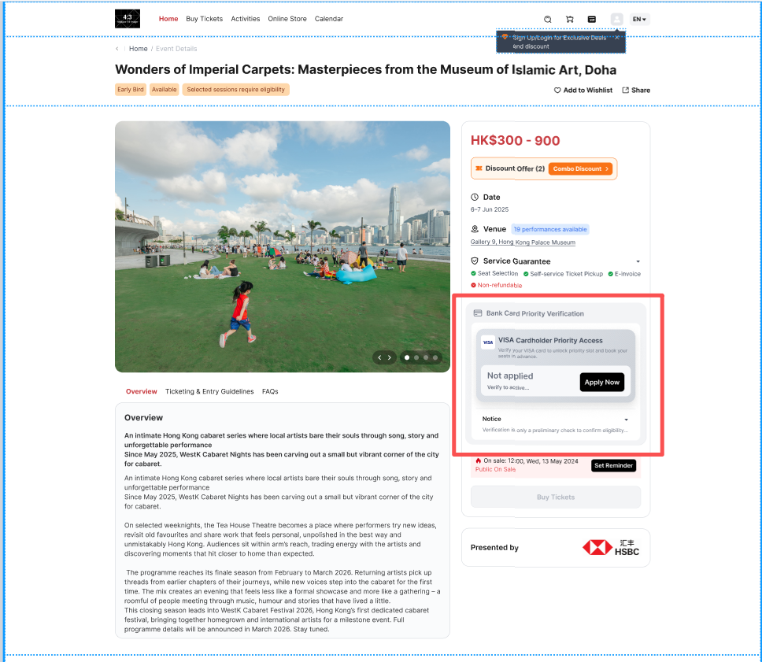
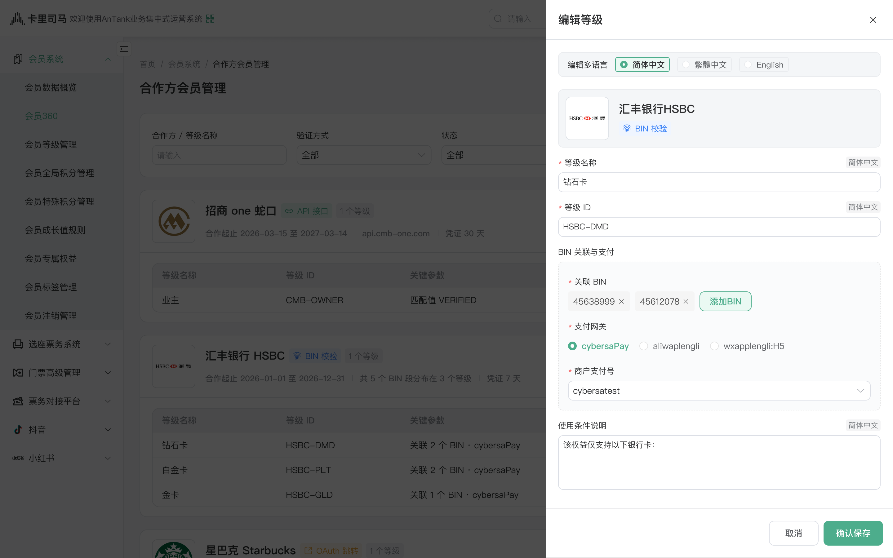

# 国际版标准官网 V1\.2\.2\-银行卡优先购C端优化

# 0\. 版本记录

|版本|日期|内容|
|---|---|---|
|V1\.0|2026\-07\-09|创建文档|
|V1\.1 |2026\-07\-10|调整C端入口显示内容为即使命中也全量展示的方式|

# 需求背景

## 当前问题

当前项目详情页可展示开售状态和购票入口，但对于“指定人群优先购”缺少统一的 C 端政策展示、资格识别和操作承接规则。项目可能同时配置银行卡、会员卡、储值卡、会员等级等多类优先购政策；若只突出单一机会，用户难以了解项目完整权益；若简单并列展示，又容易造成信息过载。因此需要建立“完整展示、分组呈现、命中前置、动作清晰”的统一展示规则。

银行卡优先购还涉及 BIN 预验证和支付阶段复核。用户在项目页通过 BIN 验证后，仅代表可进入银行卡优先购流程；实际支付时仍可能因银行卡属性、卡片状态、支付风控、发卡行或第三方支付机构实时校验失败而无法完成支付。因此 C 端需要在验证前和银行卡优先购卡片中给出明确说明，避免用户误解“验证通过等于支付一定成功”。

## 业务价值

- 统一优先购政策展示、资格状态识别和操作入口规则，提升标准化 SaaS 多客户复用能力。

- 支持银行卡、会员卡、储值卡、会员等级等多类优先购政策在 C 端清晰露出，兼顾完整性和信息层级。

- 保持优先购与购票资格独立，降低核心购票链路误判风险。

- 支持游客模式、官网多语言和港澳本地化用语习惯，提升客户演示和后续产品化落地能力。

## 需求优先级

|优先级|需求|KANO|RICE 结论|
|---|---|---|---|
|P0|官网项目详情页完整分组展示优先购政策|基本型|必须纳入首版，否则 C 端无法形成统一入口规则|
|P0|已具备、未具备、未登录、游客/临时账号下的优先购状态判断|基本型|必须纳入首版，直接影响展示可信度和购票入口可用性|
|P0|银行卡 BIN 当前页弹窗验证|基本型|必须纳入首版，银行卡优先购闭环依赖该能力|
|P0|游客/临时账号点击立即验证时的订单检查与重新登录处理|基本型|必须纳入首版，避免游客态待支付订单与正式账号登录流程冲突|
|P0|购票按钮与优先购开售状态、购票资格、库存和支付阶段银行卡复核联动|基本型|必须纳入首版，影响交易链路严谨性|
|P1|优先购区域多语言文案适配|期望型|建议首版支持，服务官网多语言展示和客户演示|
|P2|APP、小程序、其他渠道同步展示|期望型|后续迭代，本版仅覆盖官网|

# 目标

## 用户目标

- 用户进入项目详情页后，能够完整了解当前项目支持的优先购政策。

- 已具备优先购资格的用户，能够明确识别自己已具备的具体条目，并在开售后直接进入购票流程。

- 未具备但可通过银行卡验证获得资格的用户，能够在当前页完成银行卡 BIN 验证。

- 未具备会员卡或储值卡优先购资格的用户，能够通过【获取资格】入口跳转至对应购卡页面。

- 银行卡验证失败后，用户可继续尝试，或关闭弹窗返回页面查看最新优先购状态。

- 使用银行卡优先购的用户，能够在验证前理解支付阶段仍需再次校验银行卡条件。

## 业务目标

- 建立标准化、可复用的优先购 C 端完整政策展示规则。

- 支持银行卡优先购、会员卡优先购、储值卡优先购、会员等级优先购的统一分组展示、状态识别和操作承接。

- 保证优先购、购票资格、库存、开售时间、支付阶段银行卡复核等票务关键链路判断相互独立且可追踪。

- 支撑官网多语言场景下的客户演示与后续产品化落地。

# 参考文档

|文档名称|路径/链接|用途|
|---|---|---|
|综合交互原型|- [优先购C端流程交互原型V1\.html](图片和附件/优先购C端流程交互原型V1.html)<br>- [\(综合场景）优先购与银行卡验证](https://ai.studio/apps/30bdc61b-8313-4fb3-9797-a2cad07e5b00?fullscreenApplet=true)|综合优先购政策展示、验证与购票入口联动原型|
|单一银行卡优先购C端交互|- [bank\-card\-presale\-visa\-only\-demo\-v1\.html](图片和附件/bank-card-presale-visa-only-demo-v1.html)<br>- [（单一场景）Priority ticket purchase](https://ai.studio/apps/95fc27a9-55be-4b3f-a177-1e5a8f66747c?fullscreenApplet=true)|仅开启银行卡优先购场景的交互效果<br>|
|UI设计稿|https://www\.figma\.com/design/QO8xVUE4jWzBS0Z1eKpcrb/%E5%9B%BD%E9%99%85%E5%8C%96%E6%A0%87%E5%87%86%E7%89%88web\-\-\-UI\-kit?node\-id=22993\-226241\&t=gL9dHWeW1Tq2zWTq\-4||

# 用户角色

|角色|说明|
|---|---|
|未登录用户|未完成登录的官网访问用户，可查看完整优先购政策；所有资格卡与条目按未命中展示，点击受限入口时引导登录。|
|游客/临时账号用户|使用游客或临时身份访问官网的用户，可查看完整优先购政策；点击【立即验证】时按游客态待支付订单处理规则执行，点击【获取资格】时直接跳转对应购卡页面。|
|注册用户|已登录正式账号的官网用户，系统可识别其优先购资格和购票资格。<br>- 已具备优先购用户：已满足会员等级、会员卡、储值卡或银行卡优先购资格的注册用户。<br>- 银行卡持卡用户：持有支持范围内银行卡，可能通过 BIN 验证获得银行卡优先购资格的用户。|

# 业务流程

## C端优先购整体链路总览流程

本流程用于说明官网 C 端优先购从项目详情页曝光、身份识别、完整政策展示、银行卡验证、获取资格到购票入口联动的整体链路。各节点的详细判断逻辑见后续子流程。

```mermaid
flowchart TD
  A["用户进入项目详情页"] --> B["读取项目公共开售信息"]
  B --> C["读取项目已配置的优先购政策"]
  C --> D{"项目是否配置优先购？"}

  D -- "否" --> E["仅展示公共开售状态与常规购票入口"]
  D -- "是" --> F["展示优先购政策区"]
  F --> G["4.2 账号身份识别流程"]
  G --> H["4.3 优先购资格识别与组合展示流程"]

  H --> I{"用户操作"}
  I -- "登录后查看" --> J["引导登录"]
  I -- "立即验证" --> K["4.5 银行卡验证与状态刷新流程"]
  I -- "获取资格" --> L["跳转对应购卡 / 获取资格页面"]
  I -- "立即购票" --> M["4.6 购票入口联动与交易前复核流程"]

  K --> H
  L --> H
  M --> N["进入既有购票流程或拦截提示"]```

## 账号身份识别流程

本流程用于判断不同账号身份在优先购政策区中的展示和操作处理。未登录、游客、临时账号均展示完整优先购政策，但不直接判断为已具备资格；注册用户进入资格识别与组合展示流程。

```mermaid
flowchart TD
  A["进入优先购政策区"] --> B{"当前账号状态"}

  B -- "未登录" --> C["展示完整优先购政策"]
  C --> D["所有资格卡与条目按未命中展示"]
  D --> E["仅保留一个全局登录引导"]
  E --> F["点击登录后查看或立即验证时引导登录"]

  B -- "游客 / 临时账号" --> G["展示完整优先购政策"]
  G --> H["所有资格卡与条目按未命中展示"]
  H --> I["仅保留一个当前身份暂不支持识别提示"]
  I --> J{"用户点击的动作"}
  J -- "立即验证" --> K["进入 4.4 游客模式立即验证处理流程"]
  J -- "获取资格" --> L["直接跳转对应购卡页面"]

  B -- "注册用户" --> M["查询当前账号已具备的优先购资格"]
  M --> N["查询银行卡优先购验证状态"]
  N --> O["进入 4.3 优先购资格识别与组合展示流程"]```

## 优先购资格识别与组合展示流程

本流程用于说明系统如何按类型分组展示完整优先购政策，并根据用户命中状态、可购时间和优先购类型进行排序，命中条目所在资格卡优先展示。

```mermaid
flowchart TD
  A["读取全部优先购政策"] --> B["按类型分组"]
  B --> C["银行卡优先购"]
  B --> D["会员卡优先购"]
  B --> E["储值卡优先购"]
  B --> F["会员等级优先购"]

  C --> G["识别银行卡验证状态"]
  D --> H["识别账号持有的会员卡"]
  E --> I["识别账号持有的储值卡"]
  F --> J["识别账号会员等级"]

  G --> K["标记命中条目"]
  H --> K
  I --> K
  J --> K

  K --> L{"是否存在命中条目？"}
  L -- "是" --> M["命中条目所在资格卡前置"]
  M --> N["多个命中时按最早可购时间排序"]
  N --> O["可购时间一致时按类型优先级排序"]
  O --> P["银行卡 > 会员卡 > 储值卡 > 会员等级"]

  L -- "否" --> Q["按政策可购时间与类型优先级展示"]
  Q --> R["无具体可购时间时按后台配置顺序展示"]

  P --> S["输出完整分组政策列表"]
  R --> S
  S --> T["资格卡右上角展示统一状态"]
  T --> U["命中条目仅显示勾选图标"]
  U --> V["未命中条目展示对应业务动作"]```

## 游客模式立即验证处理流程

本流程用于说明游客或临时账号点击银行卡优先购【立即验证】时的处理方式。此处的未完成订单仅指游客登录态下的待支付订单；点击会员卡或储值卡【获取资格】时，不进入本流程，直接跳转对应购卡页面。

```mermaid
flowchart TD
  A["游客 / 临时账号点击立即验证"] --> B["检查当前游客账号是否存在未完成订单"]


  B -- "存在未完成订单" --> D["弹窗提醒：当前有未支付订单，是否取消订单并登出游客模式重新登录"]
  D --> E{"用户选择"}
  E -- "【取消订单】" --> F["取消未完成订单"]
  F --> G["退出游客登录态"]
  G --> H["跳转登录页面"]

  E -- "【返回】" --> I["关闭弹窗"]
  I --> J["停留当前页面"]

  B -- "不存在未完成订单" --> K["退出游客登录态"]
  K --> H```

## 银行卡验证与状态刷新流程

本流程用于说明用户点击银行卡优先购【立即验证】后的处理方式。注册用户可进入 BIN 验证弹窗；未登录用户引导登录；游客或临时账号进入游客模式立即验证处理流程。验证完成或放弃后，均刷新优先购政策区状态。

```mermaid
flowchart TD
  A["用户点击银行卡条目下的立即验证"] --> B{"当前账号状态"}

  B -- "未登录" --> C["引导登录"]
  B -- "游客 / 临时账号" --> D["进入 4.4 游客模式立即验证处理流程"]
  B -- "注册用户" --> E["打开银行卡验证弹窗"]

  E --> F["展示重要提醒与免责说明"]
  F --> G["展示当前支持验证的银行卡范围"]
  G --> H["用户输入银行卡 BIN"]
  H --> I["前端校验输入位数和格式"]
  I --> J{"输入是否有效？"}

  J -- "否" --> K["提示重新输入"]
  K --> H

  J -- "是" --> L["提交验证"]
  L --> M{"是否命中支持范围？"}

  M -- "是" --> N["记录本次银行卡优先购验证通过状态"]
  N --> O["刷新优先购政策区"]
  O --> P["对应银行卡条目标记为已具备"]
  P --> Q["重新执行排序与购票按钮状态判断"]

  M -- "否" --> R["展示验证失败结果"]
  R --> S{"用户是否继续尝试？"}
  S -- "继续" --> H
  S -- "放弃" --> T["关闭弹窗并刷新优先购状态"]```

## 购票入口联动与交易前复核流程

本流程用于说明优先购或公众开售状态如何影响购票按钮，以及点击购票入口后如何进行交易前复核。购票资格判断仅引用“购票资格独立校验”，不在本 PRD 展开；银行卡优先购在支付阶段仍需再次校验银行卡条件。

```mermaid
flowchart TD
  A["用户点击立即购票"] 
  A -- "不满足可购条件" --> C["购票按钮置灰<br/>按钮文案：即将开票"]
  A -- "满足可购条件" --> D["进入购票流程"]

  D --> E["按既有流程校验购票资格"]

  E -- "没有购票资格" --> G["提示不可购买"]
  E -- "满足购票资格" --> H["进入选场 / 选座 / 下单"]


  H -- "订单未命中银行卡优先购资格" --> J["按常规支付流程处理"]
  H -- "订单命中银行卡优先购资格" --> K["提示需使用符合条件的银行卡支付"]
  K --> L["支付阶段由支付机构 / 发卡行实时校验"]

  L -- "支付校验通过" --> N["支付成功，订单完成"]
  L -- "支付校验未通过" --> O["支付失败，提示更换符合条件的银行卡或重新支付"]
  J --> N```

# 页面设计

## 页面P1：官网项目详情页

页面目的：在项目详情页展示当前项目的公共开售状态、完整优先购政策、当前账号识别状态、购票资格状态和购票入口。

### 模块1：开售与购票入口区域

展示：公共开售状态、购票按钮、必要的倒计时信息。若项目未开启倒计时展示，则不展示倒计时，仅根据开售状态切换按钮可用性。（现有功能逻辑）

### 模块2：优先购政策区

展示：当前项目已开启的完整优先购政策，并按类型分组展示：银行卡优先购、会员卡优先购、储值卡优先购、会员等级优先购。每个类型展示为一个内部资格卡。

资格卡展示：

- 资格卡标题。

- 资格卡说明。

- 资格卡右上角统一状态。

- 该类型下的具体优先购条目。

- 命中条目的勾选图标。

- 具体购票时间提示：具体购票时间请查看网站公告。

交互：

- 注册用户命中任意条目后，该条目所在资格卡前置展示；

- 多个命中条目并存时先按最早可购时间排序，可购时间一致时按银行卡优先购、会员卡优先购、储值卡优先购、会员等级优先购排序。

- 未登录、游客/临时账号仍展示完整政策，但所有资格卡与条目按未命中展示。



### 模块3：银行卡优先购资格卡

展示：

- 银行卡优先购标题。

- 每个银行卡优先购条目的 1:1 图片或 Logo 占位。

- **银行卡优先购资格名称。\+ 等级信息（每个验证卡片含验证按钮，按合作方会员记录\+会员等级展示）**

- 银行卡优先购说明。

- 银行卡验证免责说明。

银行卡验证免责说明文案（重要提醒）：——**此项使用广告位配置（adflag=****notice\_BankPriority）****，允许用户后台自定义。（如果未配置则C端直接隐藏对应的文本区）**

> 示例：资格验证仅用于确认是否可进入优先购流程。请在支付时使用符合本次优先购条件的银行卡。受银行卡属性、卡片状态、支付风控、发卡行或第三方支付机构实时校验等因素影响，资格验证结果不代表最终支付成功或订单完成。

按钮：

- 【立即验证】：每个未命中银行卡条目展示。

    - 注册用户点击【立即验证】打开 P2 银行卡验证弹窗；

    - 未登录用户点击【立即验证】引导登录；

    - 游客/临时账号点击【立即验证】进入 P3 游客立即验证提示。

- 已验证通过的银行卡条目不展示【立即验证】。

#### B端对应功能修改

路径：会员系统 → 合作方会员管理。

【合作方会员管理】改动点：

1. 等级名称支持多语言

2. 新页面改成右侧抽屉模式

3. 新增使用条件说明，支持多语言

https://www\.figma\.com/design/tSWUnsafEQVBUHkzD6qlBJ/%E4%BC%9A%E5%91%98%E7%B3%BB%E7%BB%9Fv2\.0\-%E4%BC%9A%E5%91%98%E7%B3%BB%E7%BB%9F?node\-id=2548\-14605\&t=rXOKOS2sH2l1nZwj\-1



### 模块4：会员卡 / 储值卡优先购资格卡

展示：

- 资格卡标题。

- 资格卡说明，例如：指定会员卡持有人可参与该项目优先购；指定储值卡持有人可参与该项目优先购。

- 具体会员卡或储值卡条目名称。

- 命中条目的勾选图标。

按钮【获取资格】：会员卡或储值卡资格卡内存在未命中条目时展示。

- 注册用户点击【获取资格】跳转对应购卡页面；

- 游客/临时账号点击【获取资格】直接跳转对应购卡页面；

- 未登录用户点击【获取资格】引导登录，登录成功后按站点既有购卡入口规则继续。

### 模块5：会员等级优先购资格卡

展示：会员等级优先购标题、资格卡说明、具体会员等级名称、命中等级条目的勾选图标。

按钮：首版不提供等级提升入口。

交互：仅展示当前账号识别结果和项目支持的会员等级优先购政策；未登录、游客/临时账号按未命中展示。

### 模块6：账号状态与全局提示

展示：

- 未登录和游客/临时账号：按所有优先购资格均按“未命中”状态展示，点击操作按钮后引导登录。

    - 未登录用户登录成功后返回项目详情页并重新识别优先购资格；

    - 游客/临时账号点击【立即验证】时，按 P3 游客立即验证提示执行；页面刷新后重新获取优先购资格状态。

- 注册用户：不展示重复身份提示，仅在各资格卡内展示状态和操作。

## 页面P2：银行卡验证弹窗

页面目的：支持注册用户在当前页输入银行卡 BIN，初步验证是否符合银行卡优先购范围。

1. 模块1：重要提醒

**此项使用广告位配置（adflag=****notice\_BankPriority）**，允许用户后台自定义。（如果未配置则C端直接隐藏对应的文本区）——和项目详情页中银行卡优先购验证卡片的提示文字保持一致**。**

2. 模块2：支持范围（规则说明）：按后台配置显示对应内容（新字段）

3. 模块3：BIN 输入与提交——**固定卡号前8位，具体验证按规则系统自动验证。**

展示：银行卡 BIN 输入框。

按钮：

- 【提交验证】：提交当前输入的银行卡 BIN 进行验证。

- 【关闭】：关闭弹窗并返回项目详情页刷新优先购状态。验证失败后继续输入其他 BIN。

交互：输入框仅允许数字；输入位数按活动配置限制；提交前校验位数和格式；验证失败后停留弹窗，允许继续尝试；关闭弹窗视为放弃本次尝试，返回项目详情页刷新优先购状态。

4. 模块4：验证结果

展示：验证通过、验证失败、输入位数不符合要求等结果反馈。

## 页面P3：提示弹窗

### 模块1：未登录提示

触发：未登录用户点击【立即验证】或其他需要登录后识别的入口。

交互：直接跳转登录页面；登录成功后返回项目详情页重新识别状态。

### 模块2：游客立即验证提示

触发：游客/临时账号点击银行卡条目【立即验证】。

- 如不存在游客态待支付订单：提示将退出游客登录态并跳转登录页面。

- 如存在游客态待支付订单：提示当前有未支付订单，是否取消订单并登出游客模式重新登录。

按钮：

- 【取消订单】：取消订单、退出游客登录态并跳转登录页；

- 【返回】：关闭弹窗并停留当前页面；

### 模块3：加入购物车校验

优先购项目**不支持加购物车**，需要进行前置拦截——当前场次如果未到当前渠道的公众开售时间，那么隐藏购物车icon（或者点击后进行拦截）

## 页面P4：订单结算页命中优先购信息展示

路径：单场结算页算页。

显示当前订单命中的优先购提醒：

|类型|建议话术|
|---|---|
|银行卡优先购|本单已使用：\{合作方权益名称\-等级\}优先购资格 |
|其他优先购|本单已使用：\{会员等级/会员卡名称\}优先购资格|

todo：UI设计

# 功能规则与验收说明

本章集中管理业务规则、系统能力、异常场景与验收标准，便于研发实现和测试用例编写。业务规则仍作为唯一规则来源；功能说明、异常场景和验收标准仅引用规则编号，不重复定义规则。

## 业务规则

### 基础业务规则

|编号|规则名称|规则说明|关联页面|优先级|备注|
|---|---|---|---|---|---|
|BR001|适用范围|本期仅覆盖官网 C 端项目详情页优先购政策展示、银行卡验证弹窗、游客验证处理、购票按钮联动、进入购票前校验，以及支付阶段银行卡条件复核提示与异常承接。|P1、P2、P3|P0|不覆盖后台配置页面、APP、小程序及支付模块完整流程|
|BR002|资格独立|优先购资格与购票资格完全独立；用户需同时满足开售状态、优先购或公众开售状态、购票资格、库存和项目购票规则后才可购票。|P1、P3|P0|固定规则|
|BR003|优先购类型|当前统一纳入银行卡优先购、会员卡优先购、储值卡优先购、会员等级优先购。|P1|P0|首版展示决策支持四类|
|BR004|完整政策展示|项目配置优先购时，项目详情页应完整展示当前项目已开启的优先购政策，并按优先购类型分组展示；不再采用单一机会展示口径。|P1|P0|替代旧版“展示对象唯一”规则|
|BR005|命中前置排序|注册用户命中任意优先购条目后，该条目所在资格卡前置展示；命中多个条目时先按最早可购时间排序，可购时间一致时按银行卡优先购、会员卡优先购、储值卡优先购、会员等级优先购排序。|P1|P0|适用于资格卡排序|
|BR006|未命中排序|注册用户未命中任何优先购条目时，按政策可购时间和类型优先级展示；无法取得明确可购时间时，按后台配置顺序展示。|P1|P0|类型优先级同 BR005|
|BR007|状态展示|资格卡右上角展示该类型的统一状态；具体条目命中时仅展示勾选图标，不展示“已具备/未具备”等文字标签。|P1|P0|降低信息重复|
|BR008|条目信息展示|优先购条目展示资格名称和必要说明；会员卡、储值卡、会员等级条目不重复展示“享优先购票资格”等泛化文案；银行卡条目需支持 1:1 图片或 Logo 占位展示。|P1|P0|页面样式不在本规则展开|
|BR009|获取资格入口|会员卡优先购和储值卡优先购存在未命中条目时，资格卡内展示【获取资格】入口；注册用户点击后跳转对应购卡页面。会员等级优先购首版仅展示识别结果，不提供等级提升入口。|P1、P3|P0|不展开购卡流程|
|BR010|银行卡逐条验证入口|银行卡优先购中，每个未命中的银行卡条目均展示【立即验证】入口；已验证通过的银行卡条目不展示验证入口。|P1、P2|P0|支持多银行卡政策|
|BR011|信息卡时间展示|优先购政策卡片内不展示具体开票时间，避免不同场次开售时间差异导致误解；具体购票时间由项目介绍或网站公告承接。|P1|P0|固定规则|
|BR012|倒计时展示|优先购政策区不展示未命中或已命中优先购倒计时；公共开售倒计时按项目详情页既有开售模块规则处理。|P1|P0|防止误导用户|
|BR013|银行卡支持范围|同一银行卡优先购活动可配置多个 BIN 或卡号规则，用户输入命中任一支持范围即视为验证通过。|P2|P0|后台配置不在本 PRD 展开|
|BR014|BIN输入规则|银行卡验证仅输入卡 BIN，不要求用户选择银行或卡种；输入位数按活动配置限制，前端仅允许数字。|P2|P0|原型示例为 6 位|
|BR015|验证有效期|银行卡验证结果在配置有效期内有效；过期后需重新验证；C 端不展示该时长。|P1、P2|P0|固定规则|
|BR016|验证失败处理|银行卡验证失败后保持未验证状态；用户可继续在弹窗内重复尝试，或关闭弹窗返回项目页刷新优先购状态。|P2|P0|固定规则|
|BR017|验证通过处理|银行卡验证通过后，系统将对应银行卡优先购条目更新为已具备，并重新执行资格卡排序、状态展示和购票按钮状态判断。|P1、P2|P0|固定规则|
|BR018|银行卡验证免责说明|银行卡资格验证仅用于确认是否可进入优先购流程，不代表最终支付成功或订单完成；C 端需在银行卡卡片和验证弹窗展示相应说明。|P1、P2|P0|与支付阶段复核配套|
|BR019|未登录处理|未登录用户可查看完整优先购政策，所有资格卡与条目按未命中展示；页面仅保留一个全局【登录后查看】引导；点击【立即验证】、【获取资格】或相关受限操作时引导登录。|P1、P3|P0|登录成功后重新判断|
|BR020|游客处理|游客/临时账号可查看完整优先购政策，所有资格卡与条目按未命中展示；页面仅保留一个当前身份暂不支持识别提示。点击【立即验证】时进入游客模式订单检查与重新登录流程；点击【获取资格】时直接跳转对应购卡页面。|P1、P3|P0|游客待支付订单仅指游客登录态下待支付订单|
|BR021|游客立即验证订单处理|游客/临时账号点击【立即验证】时，若存在游客态待支付订单，需提示是否取消订单并登出游客模式重新登录；用户确认后取消订单、退出游客登录态并跳转登录页，用户取消则停留当前页。若不存在游客态待支付订单，则直接退出游客登录态并跳转登录页。|P1、P3|P0|仅适用于【立即验证】|
|BR022|库存规则|优先购不设置独立库存，仍使用公共库存；优先购不保证一定购得门票。|P1、P3|P0|固定规则|
|BR023|交易前复核|进入场次、票种、选座、加入购物车、生成订单前，系统仍需再次校验优先购资格、购票资格、库存和项目规则。|P1、P3|P0|固定规则|
|BR024|支付阶段银行卡复核|使用银行卡优先购资格下单时，支付阶段仍需使用符合本次优先购条件的银行卡；受银行卡属性、卡片状态、支付风控、发卡行或第三方支付机构实时校验影响，可能出现预验证通过但支付失败的情况。|P1、P2、P3|P0|仅定义票务链路提示与拦截关系，不展开支付模块|
|BR025|多语言文案|官网启用多语言时，优先购区域、验证弹窗和提示弹窗应跟随当前站点语言展示；英文统一使用 Priority Booking。|P1、P2、P3|P1|首版建议支持简体、繁中、英文|

### 优先购资格状态与组合展示规则

#### 统一身份状态规则

|状态名称|适用对象|判断逻辑|页面展示与操作|关联规则|
|---|---|---|---|---|
|未登录|未登录用户|不进行银行卡、会员卡、储值卡、会员等级等任何优先购资格命中判断。|展示完整优先购政策，所有资格卡与条目按未命中展示；仅保留一个全局登录引导；点击【立即验证】、【获取资格】或受限操作时引导登录，登录成功后重新判断。|BR019|
|游客/临时账号|游客或临时账号|不进行银行卡、会员卡、储值卡、会员等级等任何优先购资格命中判断。|展示完整优先购政策，所有资格卡与条目按未命中展示；仅保留一个身份暂不支持识别提示；点击【立即验证】进入游客订单检查与重新登录流程；点击【获取资格】直接跳转对应购卡页面。|BR020、BR021|
|注册用户|已登录注册用户|系统识别当前账号已具备的银行卡验证状态、会员卡、储值卡和会员等级。|按完整政策展示、命中前置排序和条目状态规则展示；未命中条目展示对应业务动作。|BR004、BR005、BR006、BR007、BR008、BR009、BR010|

#### 单一资格来源状态字典

|状态名称|本来源是否命中|C端展示含义|操作入口|是否可按该资格优先购|关联规则|
|---|---|---|---|---|---|
|银行卡优先购||||||
|未验证|否|当前账号尚未完成该银行卡优先购条目的 BIN 验证。|该银行卡条目展示【立即验证】；点击后进入银行卡验证弹窗。|否|BR010、BR013、BR014|
|验证失败|否|当前输入 BIN 未命中支持范围，用户仍可继续尝试。|弹窗内允许重新输入；关闭后刷新项目页状态。|否|BR013、BR016|
|已验证|是|当前账号已通过该银行卡优先购条目验证，可按该银行卡优先购资格参与购票。|该条目标记勾选图标，不展示【立即验证】。|是|BR015、BR017|
|验证过期|否|上一次银行卡验证结果已超过配置有效期，需重新验证。|该银行卡条目重新展示【立即验证】。|否|BR015|
|会员卡优先购||||||
|已具备|是|当前账号已持有满足条件的会员卡，可按会员卡优先购资格参与购票。|具体条目标记勾选图标；若同卡片内仍有未具备条目，资格卡仍可展示【获取资格】。|是|BR005、BR007、BR009|
|未具备|否|当前账号未持有该会员卡。|会员卡资格卡存在任一未具备条目时，展示【获取资格】并跳转对应购卡页面。|否|BR008、BR009|
|储值卡优先购||||||
|已具备|是|当前账号已持有满足条件的储值卡，可按储值卡优先购资格参与购票。|具体条目标记勾选图标；若同卡片内仍有未具备条目，资格卡仍可展示【获取资格】。|是|BR005、BR007、BR009|
|未具备|否|当前账号未持有该储值卡。|储值卡资格卡存在任一未具备条目时，展示【获取资格】并跳转对应购卡页面。|否|BR008、BR009|
|会员等级优先购||||||
|已具备|是|当前账号会员等级满足项目优先购要求，可按会员等级优先购资格参与购票。|具体条目标记勾选图标。|是|BR005、BR007|
|未具备|否|当前账号会员等级未满足项目优先购要求。|首版不提供等级提升入口，仅展示政策信息。|否|BR008|

#### 多资格组合展示说明

说明：本表用于解释多优先购资格并存时的展示决策，不作为独立业务规则编号来源。研发、测试和评审追踪时，统一引用右侧 BR 业务规则。

|组合规则|判断逻辑|C端展示结果|关联规则|
|---|---|---|---|
|完整分组展示|项目开启一个或多个优先购政策。|优先购政策区完整展示已配置政策，并按银行卡优先购、会员卡优先购、储值卡优先购、会员等级优先购等类型分组。|BR003、BR004|
|命中资格卡前置|注册用户命中任意优先购条目。|命中条目所在资格卡前置；命中条目使用勾选图标标识。|BR005、BR007|
|多命中排序|注册用户同时命中多个优先购条目。|先按最早可购时间排序；可购时间一致时按银行卡、会员卡、储值卡、会员等级排序。|BR005|
|无命中排序|注册用户未命中任何优先购条目。|按政策可购时间和类型优先级展示；无明确可购时间时按后台配置顺序展示。|BR006|
|银行卡逐条验证|银行卡优先购下存在多个未验证条目。|每个未命中银行卡条目均展示【立即验证】；验证通过后仅对应条目标记为已具备。|BR010、BR017|
|会员卡/储值卡获取资格|会员卡或储值卡资格卡内存在任一未具备条目。|资格卡内展示【获取资格】入口；已具备条目仍保留勾选标识，未具备条目不展示“未具备”文字标签。|BR007、BR009|
|会员等级仅展示|会员等级优先购存在未具备条目。|展示等级政策信息，不提供等级提升入口。|BR008、BR009|
|信息降噪|条目标题、说明、状态和按钮同时存在时。|不展示具体开票时间；不重复展示泛化“享优先购票资格”文案；状态集中在资格卡右上角，条目仅使用图标标识命中。|BR007、BR008、BR011|
|银行卡风险提示|页面展示银行卡优先购或打开验证弹窗。|展示资格验证仅用于进入优先购流程、支付阶段仍需再次校验、验证结果不代表最终支付成功或订单完成的说明。|BR018、BR024|
|倒计时展示控制|优先购政策存在但用户未命中或已命中。|优先购政策区不展示优先购倒计时；公共开售倒计时按既有开售模块处理。|BR012|
|验证后状态刷新|银行卡验证通过、失败关闭、验证过期或页面刷新。|系统刷新优先购政策区状态，并重新执行资格卡排序、状态展示和购票按钮状态判断。|BR015、BR016、BR017|
|购票资格独立校验|用户点击【立即购票】进入交易链路。|仍按既有流程独立校验购票资格、库存和项目购票规则；银行卡优先购订单在支付阶段再次校验银行卡条件。|BR002、BR022、BR023、BR024|

#### 组合展示示例

|场景|用户状态|判断结果|C端展示结果|关联规则|
|---|---|---|---|---|
|未登录用户访问开启优先购项目|未登录|不进行优先购资格命中判断。|展示完整优先购政策，所有资格卡与条目按未命中展示，仅保留一个全局登录引导。|BR019|
|游客访问开启优先购项目|游客或临时账号|不进行优先购资格命中判断。|展示完整优先购政策，所有资格卡与条目按未命中展示，仅保留一个身份暂不支持识别提示。|BR020|
|游客点击立即验证且存在待支付订单|游客或临时账号|当前游客态存在待支付订单。|弹窗提示是否取消订单并登出游客模式重新登录；确认后取消订单、退出游客登录态并跳转登录页，取消则停留当前页。|BR021|
|游客点击获取资格|游客或临时账号|获取资格不进入游客立即验证处理。|直接跳转对应购卡页面。|BR020|
|注册用户未命中任何资格|注册用户，未命中|当前账号未具备任一优先购资格。|完整展示政策；银行卡未命中条目展示【立即验证】；会员卡/储值卡资格卡展示【获取资格】；会员等级仅展示政策信息。|BR004、BR006、BR009、BR010|
|注册用户命中会员等级，同时存在未验证银行卡|注册用户，已命中会员等级，银行卡未验证|命中会员等级条目，银行卡仍可尝试验证。|会员等级资格卡按命中排序前置；银行卡资格卡继续展示未验证条目的【立即验证】入口。|BR005、BR007、BR010|
|注册用户命中会员卡，仍有未具备会员卡条目|注册用户，部分会员卡已具备|同一资格卡内既有已具备条目，也有未具备条目。|已具备条目标记勾选图标；资格卡仍展示【获取资格】入口。|BR007、BR009|
|同时命中银行卡、会员卡、储值卡，时间一致|注册用户，多项已命中|多项命中且可购时间一致。|银行卡资格卡排序在前，其次会员卡、储值卡、会员等级。|BR005|
|同时命中储值卡和会员等级，储值卡更早|注册用户，多项已命中|储值卡可购时间早于会员等级。|储值卡资格卡排序在会员等级资格卡之前。|BR005|
|银行卡验证通过|注册用户，银行卡验证成功|对应银行卡条目状态更新为已具备。|对应银行卡条目标记勾选图标，隐藏该条目【立即验证】，刷新资格卡排序和购票按钮状态。|BR015、BR017|
|银行卡验证失败后继续尝试|注册用户，银行卡验证失败|当前输入 BIN 不匹配，但允许重复尝试。|停留验证弹窗，展示失败提示，允许重新输入 BIN。|BR013、BR016|
|银行卡验证失败后放弃尝试|注册用户，银行卡验证失败并关闭弹窗|系统返回项目详情页并刷新优先购状态。|对应银行卡条目保持未验证状态，仍可再次点击【立即验证】。|BR016|
|银行卡预验证通过但支付阶段失败|注册用户，已通过银行卡优先购验证|支付阶段使用的银行卡不符合实时校验要求或被发卡行/支付机构拦截。|支付失败，提示用户更换符合条件的银行卡或重新支付；不承诺订单完成。|BR018、BR024|

### 配置项

说明：以下配置项为 C 端展示和判断依赖的数据或规则。本 PRD 不设计后台配置页面。

|配置项|是否可配置|默认值|说明|
|---|---|---|---|
|是否开启优先购|是|关闭|项目是否在官网 C 端展示优先购能力。|
|优先购类型|是|暂无|支持银行卡、会员卡、储值卡、会员等级。|
|类型展示优先级|否|银行卡 \> 会员卡 \> 储值卡 \> 会员等级|仅在可购时间一致时生效。|
|优先购可购时间|是|暂无|用于资格卡排序和购票按钮状态判断；项目页卡片不展示具体时间。|
|优先购条目名称|是|暂无|用于展示银行卡、会员卡、储值卡、会员等级等具体条目名称。|
|优先购条目说明|是|暂无|用于展示各条目的必要说明，不承载具体开票时间。|
|银行卡条目图片|是|银行 Logo 占位|用于银行卡优先购条目的 1:1 图片或 Logo 展示。|
|银行卡支持范围|是|暂无|可配置支持银行、卡组织、卡种、BIN 范围等展示及验证范围。|
|BIN 输入位数|是|6 位|根据活动配置限制输入位数，原型示例为 6 位。|
|验证结果有效期|是|1 天|系统按配置判断验证结果是否过期；C 端不主动展示有效期说明。|
|会员卡获取资格跳转地址|是|暂无|用于会员卡优先购【获取资格】入口跳转。|
|储值卡获取资格跳转地址|是|暂无|用于储值卡优先购【获取资格】入口跳转。|
|是否展示倒计时|是|开启|仅影响项目详情页既有公共开售倒计时；优先购政策区不展示优先购倒计时。|
|优先购独立库存|否|否|首版不设置独立库存，使用公共库存。|
|适用终端|否|官网|首版仅覆盖官网 C 端。|
|多语言展示|是|跟随站点语言|启用后展示简体、繁中、英文文案；英文使用 Priority Booking。|

## 功能说明

|功能|适用端|关联页面|说明|
|---|---|---|---|
|优先购政策完整展示|官网 C 端|P1|系统支持在项目详情页完整展示项目已开启的优先购政策，并按优先购类型分组展示。|
|用户身份识别|官网 C 端|P1、P3|系统支持区分未登录、游客/临时账号、注册用户，并按规则展示完整政策、全局提示和可用操作。|
|资格状态识别与排序|官网 C 端|P1|系统支持识别注册用户已具备的优先购条目，并按命中状态、可购时间和类型优先级调整资格卡顺序。|
|条目状态展示|官网 C 端|P1|系统支持在资格卡右上角展示统一状态，并在命中条目上展示勾选图标。|
|银行卡 BIN 验证|官网 C 端|P1、P2|系统支持注册用户在当前页弹窗中提交银行卡 BIN，验证是否符合银行卡优先购支持范围。|
|银行卡验证失败重复尝试|官网 C 端|P2|系统支持银行卡验证失败后继续输入其他 BIN 重试，或关闭弹窗返回项目页刷新状态。|
|游客立即验证处理|官网 C 端|P1、P3|系统支持游客/临时账号点击【立即验证】时检查游客态待支付订单，并按用户选择处理退出游客登录态和登录跳转。|
|获取资格跳转|官网 C 端|P1、P3|系统支持会员卡、储值卡优先购在存在未具备条目时展示【获取资格】入口并跳转对应购卡页面。|
|购票入口联动|官网 C 端|P1、P3|系统支持根据开售状态、优先购状态、购票资格状态和库存规则切换购票按钮及拦截提示。|
|支付阶段银行卡复核提示|官网 C 端|P1、P2、P3|系统支持在银行卡优先购说明和支付异常提示中表达支付阶段仍需再次校验银行卡条件。|
|多语言文案切换|官网 C 端|P1、P2、P3|系统支持优先购区域、验证弹窗和提示弹窗跟随官网语言切换展示简体、繁中、英文文案。|

## 异常场景

|编号|异常场景|触发条件|触发结果|提示文案|适用页面|关联规则|
|---|---|---|---|---|---|---|
|E001|未登录触发受限入口|未登录用户点击【登录后查看】、【立即验证】、【获取资格】或其他需要登录后识别的入口|引导用户登录|登录后可查看当前账号是否具备优先购资格。|P1、P3|BR019|
|E002|游客立即验证且存在待支付订单|游客/临时账号点击【立即验证】，且当前游客态存在待支付订单|弹窗要求用户确认是否取消订单并重新登录|当前有未支付订单，是否取消订单并登出游客模式重新登录？|P1、P3|BR020、BR021|
|E003|游客立即验证且无待支付订单|游客/临时账号点击【立即验证】，且当前游客态不存在待支付订单|退出游客登录态并跳转登录页|将退出游客模式并前往登录页面。|P1、P3|BR020、BR021|
|E004|BIN位数或格式不符|用户提交的 BIN 位数或格式不符合活动配置|阻止提交，停留弹窗|请输入正确位数的银行卡 BIN。|P2|BR014|
|E005|BIN不匹配|用户输入 BIN 未命中支持范围|展示失败提示，允许继续尝试|暂未匹配本项目支持的银行卡优先购范围，请重新输入。|P2|BR013、BR016|
|E006|验证失败后关闭|用户验证失败后关闭弹窗或放弃尝试|返回项目详情页并刷新优先购状态|暂无额外提示，页面展示刷新后的优先购状态。|P1、P2|BR016|
|E007|验证结果过期|用户验证状态超过配置有效期|视为未验证，需重新验证|验证结果已过期，请重新验证。|P1、P2|BR015|
|E008|购票资格不满足|用户已具备优先购资格并到达可购时间，但购票资格未满足|拦截进入购票链路|当前账号未满足本项目购票资格要求，无法继续进入购票链路。|P1、P3|BR002、BR023|
|E009|库存不足|用户进入购票链路或提交订单时库存已不足|按既有购票流程提示库存不足|当前库存不足，请重新选择。|P1、P3|BR022、BR023|
|E010|开售时间未到|用户未到公众开售或已具备优先购对应可购时间时点击购票按钮|按钮不可点击或不进入购票流程|即将开票。|P1|BR002、BR023|
|E011|支付阶段银行卡复核失败|用户使用银行卡优先购资格下单，但支付阶段银行卡实时校验失败|支付失败，不完成订单|支付银行卡不符合本次优先购条件，请更换符合条件的银行卡或重新支付。|P3|BR018、BR024|
|E012|状态变化|用户停留页面期间资格状态、开售状态或库存状态发生变化|刷新页面状态后重新判断|当前状态已更新，请以页面最新展示为准。|P1、P2|BR005、BR017、BR023|
|E013|系统繁忙|验证、状态刷新或交易前复核时系统繁忙|保持当前页面，提示稍后重试|系统繁忙，请稍后再试。|P1、P2、P3|BR016、BR023|
|E014|多语言文案缺失|当前语言缺少对应文案|使用默认简体文案兜底|暂无用户提示。|P1、P2、P3|BR025|

## 验收标准

|编号|验收项|关联页面|关联规则|Given|When|Then|
|---|---|---|---|---|---|---|
|AC\-001|未开启优先购不展示入口|P1|BR001|项目未开启优先购|用户进入项目详情页|页面不展示优先购政策区，仅按公众开售状态展示购票入口|
|AC\-002|完整分组展示优先购政策|P1|BR003、BR004|项目开启多类优先购政策|用户进入项目详情页|页面按银行卡、会员卡、储值卡、会员等级等类型分组展示完整优先购政策|
|AC\-003|未登录用户展示完整政策|P1、P3|BR019|用户未登录且项目开启优先购|用户进入项目详情页|页面展示完整优先购政策，所有条目按未命中展示，并仅保留一个全局登录引导|
|AC\-004|游客用户展示完整政策|P1、P3|BR020|用户为游客/临时账号且项目开启优先购|用户进入项目详情页|页面展示完整优先购政策，所有条目按未命中展示，并仅保留一个身份暂不支持识别提示|
|AC\-005|命中资格卡前置|P1|BR005、BR007|注册用户命中任一优先购条目|用户进入项目详情页|命中条目所在资格卡前置展示，命中条目展示勾选图标|
|AC\-006|多命中排序|P1|BR005|注册用户同时命中多个优先购条目|用户进入项目详情页|页面先按最早可购时间排序；可购时间一致时按银行卡、会员卡、储值卡、会员等级排序|
|AC\-007|无命中排序|P1|BR006|注册用户未命中任何优先购条目|用户进入项目详情页|页面按政策可购时间和类型优先级展示；无明确可购时间时按后台配置顺序展示|
|AC\-008|条目状态降噪|P1|BR007、BR008|页面展示优先购资格卡和条目|用户查看优先购政策区|资格卡右上角展示统一状态，具体条目不展示“已具备/未具备”文字标签，命中条目仅展示勾选图标|
|AC\-009|信息卡不展示具体开票时间|P1|BR011|项目存在多个场次且优先购开票时间可能不同|用户查看优先购政策区|政策卡片不展示具体开票时间，并提示具体购票时间请查看网站公告|
|AC\-010|优先购政策区不展示倒计时|P1|BR012|项目开启优先购|用户查看优先购政策区|优先购政策区不展示未命中或已命中的优先购倒计时|
|AC\-011|银行卡逐条验证入口|P1、P2|BR010|银行卡优先购存在多个未命中条目|用户查看银行卡优先购资格卡|每个未命中银行卡条目均展示【立即验证】，已验证条目不展示【立即验证】|
|AC\-012|银行卡条目图片展示|P1|BR008|银行卡优先购存在一个或多个条目|用户查看银行卡优先购资格卡|每个银行卡条目展示 1:1 图片或 Logo 占位|
|AC\-013|会员卡和储值卡获取资格|P1、P3|BR009|注册用户查看会员卡或储值卡资格卡，且卡内存在未命中条目|用户点击【获取资格】|系统跳转对应购卡页面|
|AC\-014|未登录点击获取资格|P1、P3|BR019|用户未登录且会员卡或储值卡资格卡展示【获取资格】|用户点击【获取资格】|系统引导用户登录，登录成功后按站点既有购卡入口规则继续|
|AC\-015|会员等级不提供提升入口|P1|BR009|项目配置会员等级优先购|用户查看会员等级优先购资格卡|页面仅展示等级政策和识别结果，不展示等级提升入口|
|AC\-016|银行卡验证弹窗打开|P2|BR013、BR014、BR018|注册用户点击银行卡条目【立即验证】|系统打开验证弹窗|弹窗展示重要提醒、支持范围、BIN 输入框和提交入口|
|AC\-017|BIN输入限制|P2|BR014|用户打开银行卡验证弹窗|用户输入非数字或超过配置位数|输入框仅保留数字并限制最大位数|
|AC\-018|BIN位数不足拦截|P2|BR014|用户输入位数不足的 BIN|用户提交验证|系统提示请输入正确位数，不提交验证结果|
|AC\-019|验证成功刷新状态|P1、P2|BR015、BR017|用户输入命中支持范围的 BIN|用户提交验证并确认|系统记录验证结果，对应银行卡条目标记为已具备，并刷新资格卡排序和购票按钮状态|
|AC\-020|验证失败可重复尝试|P2|BR016|用户输入未命中的 BIN|用户提交验证|弹窗展示失败提示，用户可继续输入其他 BIN 再次提交|
|AC\-021|验证失败后放弃尝试|P1、P2|BR016|用户验证失败后不再尝试|用户关闭弹窗|系统返回项目详情页并刷新优先购状态，对应银行卡条目仍可再次点击【立即验证】|
|AC\-022|验证结果过期重新验证|P1、P2|BR015|用户银行卡验证结果已超过有效期|用户进入项目详情页|系统按未验证状态展示，对应银行卡条目重新展示【立即验证】|
|AC\-023|游客立即验证存在待支付订单|P1、P3|BR020、BR021|游客/临时账号存在游客态待支付订单|用户点击【立即验证】|系统提示是否取消订单并重新登录；确认后取消订单、退出游客登录态并跳转登录页，取消则停留当前页|
|AC\-024|游客立即验证无待支付订单|P1、P3|BR020、BR021|游客/临时账号不存在游客态待支付订单|用户点击【立即验证】|系统退出游客登录态并跳转登录页|
|AC\-025|游客点击获取资格|P1、P3|BR020|用户为游客/临时账号|用户点击【获取资格】|系统直接跳转对应购卡页面，不进入游客立即验证处理|
|AC\-026|优先购开售后可购|P1|BR002、BR023|用户已具备优先购资格且到达对应可购时间，购票资格满足|用户点击【立即购票】|系统进入既有场次、票种或选座流程|
|AC\-027|购票资格不满足拦截|P1、P3|BR002、BR023|用户已具备优先购资格且到达可购时间，但购票资格不满足|用户点击【立即购票】|系统拦截并提示购票资格未满足|
|AC\-028|库存不保证|P1、P3|BR022、BR023|用户已具备优先购资格并进入购票流程|库存发生变化或库存不足|系统按既有购票流程提示库存不足或要求重新选择|
|AC\-029|银行卡支付阶段复核失败|P3|BR018、BR024|用户使用银行卡优先购资格下单|支付阶段银行卡实时校验失败|系统提示更换符合条件的银行卡或重新支付，订单不完成|
|AC\-030|多语言切换|P1、P2、P3|BR025|官网启用多语言且用户切换语言|用户在简体、繁中、英文之间切换|优先购区域、验证弹窗、按钮和提示文案跟随当前语言展示，业务状态保持不变|


